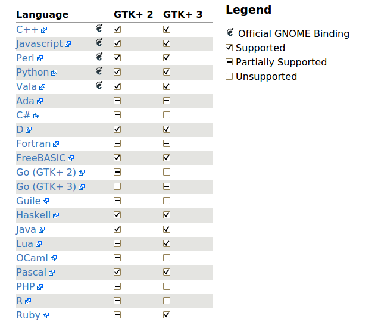
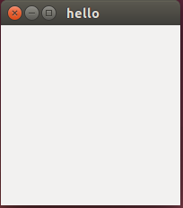

**（一）：写在前面**

从现在开始，我准备学习GTK+2.0库进行linux下的界面程序开发．从我们程序员的角度来讲，接触到的第一个程序肯定是Hello World.所以，我们现在就从Hello World学起．在这里仅仅是构建了一个GTK+的空白窗口，主要的目的是先感受一下GTK+的开发，既然他是一个程序库，之前我又有过QTGui方面的开发经验，估计学习起来应该不是很费劲．

**（二）：初识GTK+**

*１：什么是GTK+*

GTK+或者是称作GIMP套件，是一个创建图形用户接口的多平台工具套件．GTK+提供了一套完整的组件库，无论是小工具的开发还是一个大型应用的开发都是非常合适的．

*２：可以在哪里使用*

任何地方都可以使用GTK+．只要你的平台上安装有GTK+的图形库，就可以在任何平台上进行GTK+的开发和使用．GTK+是跨平台的，它提供了简单易用的API来加速你的开发时间．下面我们来看一下官网上提供的使用GTK+开发的程序的截图：


*３：GTK+支持的语言*

GTK+虽然使用C编写，但是他现在已经被设计支持很多编程语言，不仅仅是C/C++．下面我们来看一下GTK+锁支持的语言列表：



*４：GTK+进一步了解*

GTK+是一个部件工具包．他是由C语言开发，使用GObject，一个用于C的面向对象的框架实现的．组件是在一个层次被组织的．窗口组件是主容器．用户接口是随后通过向窗口中添加按钮，下拉菜单，输入框和其他组件构建的．如果拟正在创建一个复杂的用户结构，推荐你使用GtkBuilder和他对用的GTK专用的标记描述语言，而不是手动的嵌入到接口中．你可以使用一个可视化的用户接口编辑器，就像Glade．

GTK是事件驱动的．套件监听事件，例如在一个按钮上的点击事件，并将事件传递到你的应用中．在开发GTK+应用程序之前，我们需要安装GTK+2.0的以来和库函数．

**（三）：Hello World**

下面我们就需要新建一个C程序来编写一个最简单的GTK+程序．

*１：新建一个hello.c文件*
*２：包含我们构建GTK+程序需要的头文件gtk/gtk.h*
*３：初始化整个GTK+程序*
*４：添加窗口*
*５：显示窗口*
*６：进入主循环*

下面我们来看一下我们的代码：

```
#include <gtk/gtk.h>

int main(int argc,char *argv[])
{
	GtkWidget *window;

	// 初始化GTK+程序，必不可少
	gtk_init(&argc,&argv);

	window = gtk_window_new(GTK_WINDOW_TOPLEVEL);

	// 生成窗体之后需要显示
	gtk_widget_show(window);
	
	// 相当于让程序进入主循环，等待事件的发生
	gtk_main();

	return 0;
}

```

**（四）：编译GTK+程序**

当然，编译就比较简单了，使用GCC工具就可以编译．不过在这里需要一个工具，那就是pkg-config,他会为自动编译提供需要的include文件．好了，那么我们就使用下面的命令来编译我们的程序：

```
gcc hello.c -o hello `pkg-config --libs --cflags gtk+-2.0`
```

注意，这里将pkg-config引起来的是反引号．

**（五）：运行程序**

编译完成之后我们就可以直接使用下面的命令来运行我们的程序：

```
./hello
```

这样，程序就成功运行了，我们来看一下运行的效果：



**（六）：写在后面**

与其临渊羡鱼，不如退而结网。


