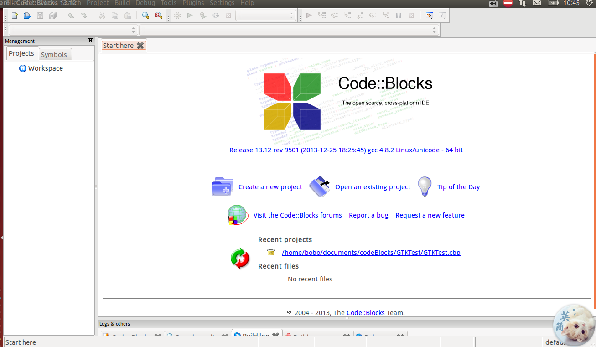
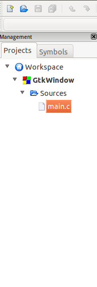
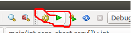

**（一）：写在前面**

在第一节中，已经体会到了GTK桌面开发的效果，同时也了解到有很多使用GTK库开发的例子．同时上一节我们使用GTK开发了一个简单的窗口程序，在这一节中，我们就进入到窗口的学习．窗口是承载多个组件的容器．在窗口中我们可以放置菜单，工具等组件．同时，在这一小节的开始，我们先学会使用一个IDE来编写GTK程序，这样，开发起来比较简单方便，因为他有一些提示功能等．

**（二）：CodeBlocks编写GTK程序**

*１：下载安装CodeBlocks*

CodeBlocks是一个非常好用的C/c++编程IDE，在CodeBlocks中，可以进行Qt开发，GTK开发，嵌入式开发等等．至于CodeBlocks的安装，很简单，直接从官网http://www.codeblocks.org 下载安装即可．安装完成后，打开我们的CodeBlocks．



*２：CodeBloks开发GTK程序*

1. 选择File->New->Project..
2. 在弹出的对话框中选择GTK+ Project
3. 选择下一步，填写项目的名称以及项目所在路径,在这里我们的项目名称为"GTkWindow"
4. 选择下一步，选择编译器为GNU GCC Compiler
5. 最后点击finish

完成之后，在我们的CodeBlocks中的左边就会出现源码树，是这样子的：



在main.c中，CodeBlocks为我们新建了一个窗口，我们可以删除编写我们自己的程序，也可以接着修改这个程序．

*３：编写程序*

在这里，我们将main.c里面的程序清空，将我们上一节的代码复制粘贴到这里．

```
#include <gtk/gtk.h>

int main(int argc,char *argv[])
{
    GtkWidget *window;

    gtk_init(&argc,&argv);

    window = gtk_window_new(GTK_WINDOW_TOPLEVEL);

    gtk_widget_show(window);

    gtk_main();

    return 0;
}

```

编写完成之后，看下面这张图：



我用红色笔圈出来的左边这个是编译，后面这个是运行，所以我们先点击左边这个，再点击后面这个就能够正常运行我们的程序了．

如果程序编写错误，编译的时候，就会报错，可以根据错误定位到哪一行出错了，非常方便．

**（四）：GTK+窗口**

我们可以通过GTK+-2.0的API来查看GtkWindow的属性和函数．

https://developer.gnome.org/gtk2/stable/GtkWindow.html

下面我们根据API来构造一个窗口程序．

```
#include <gtk/gtk.h>

//制作应用图标
GdkPixbuf *create_pixbuf(const gchar *filename)
{
    GdkPixbuf *pixbuf;
    GError *error = NULL;

    pixbuf = gdk_pixbuf_new_from_file(filename,&error);

    if(!pixbuf)
    {
        fprintf(stderr,"%s\n",error->message);
        g_error_free(error);
    }

    return pixbuf;
}

int main(int argc,char *argv[])
{
    GtkWidget *window;

    gtk_init(&argc,&argv);

    window = gtk_window_new(GTK_WINDOW_TOPLEVEL);
    //设置标题
    gtk_window_set_title(GTK_WINDOW(window),"Center");
    //设置默认大小
    gtk_window_set_default_size(GTK_WINDOW(window),230,150);
    //设置位置
    gtk_window_set_position(GTK_WINDOW(window),GTK_WIN_POS_CENTER);

    //设置程序图标
    gtk_window_set_icon(GTK_WINDOW(window),create_pixbuf("icon.png"));
    gtk_widget_show(window);

    //注册关闭事件
    g_signal_connect_swapped(G_OBJECT(window),"destroy",G_CALLBACK(gtk_main_quit),NULL);

    gtk_main();

    return 0;
}

```

注意，这里的icon.png我们需要这样引入，将icon.png复制到工程根文件夹里面，然后，在CodeBlocks中的项目名称上右键->Add files->找到icon.png，添加即可．

这样完成之后，就会生成一个带有图标的在屏幕中间的窗口．

**（五）：多说一句**

对于GtkWindow有很多函数和属性，但是这里我们肯定不可能一下就全都记住，我们需要掌握的是操作GtkWindow的方法，这样就能够举一反三，通过API就会使用别的方法去操作窗口了．

**（六）：写在后面**

这个世界不是因为你能做什么，而是你该做什么。　－－　mayun