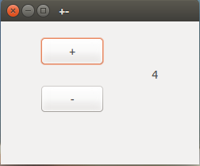

**（一）：写在前面**

在这一个小节当中，主要是通过一个窗口实例来实现对GTK+的整体理解。我们这个实例比较简单，就是实现两个按钮和一个标签，按钮上显示的是加号和减号，标签的初始值为0.每按下一次增加按钮，标签中的数字就会加1，每按下一次减少按钮，标签中的数字就会减1.就是一个这样的功能。这里面设计到的问题有：信号槽机制，布局也就是Layout等。

**（二）：整体思路**

```flow
st=>start: 初始化程序(gtk_init())
e=>end: 程序无限循环（gtk_main()）
op1=>operation: 初始化各个组件
op2=>operation: 布局和添加组件
op3=>operation: window显示所有组件
op3=>operation: window显示所有组件
op4=>operation: 注册信号槽
st->op1->op2->op3->op4->e 
```

这个就是整体的设计思路。

**（三）：源码和运行**

在Codeblocks中新建GTK Project，运行下面的代码：

```
#include <gtk/gtk.h>

gint count = 0;
char buf[5];

//增加按钮每次按下，label中的数就会加1
void increase(GtkWidget* widget,gpointer label){
    count++;
    sprintf(buf,"%d",count);
    gtk_label_set_text(label,buf);
}

//减小按钮每次按下，label中的数就会减小1
void decrease(GtkWidget *widget,gpointer label){
    count--;
    sprintf(buf,"%d",count);
    gtk_label_set_text(label,buf);
}

int main(int argc,char *argv[]){

    GtkWidget *label;
    GtkWidget *window;
    GtkWidget *frame;
    GtkWidget *plus;
    GtkWidget *minus;

    gtk_init(&argc,&argv);

    window = gtk_window_new(GTK_WINDOW_TOPLEVEL);  //新建窗口
    gtk_window_set_position(GTK_WINDOW(window),GTK_WIN_POS_CENTER);  //窗口放在屏幕中间
    gtk_window_set_default_size(GTK_WINDOW(window),250,180); //设置窗口的大小
    gtk_window_set_title(GTK_WINDOW(window),"+-");  //设置窗口的标题

    frame = gtk_fixed_new(); //这个是GTK+布局中的一种，后面讲到
    gtk_container_add(GTK_CONTAINER(window),frame); //向window容器中添加布局

    plus = gtk_button_new_with_label("+");  //新建按钮
    gtk_widget_set_size_request(plus,80,35); //设置增加按钮的大小
    gtk_fixed_put(GTK_FIXED(frame),plus,50,20);  //将按钮放在布局中

    minus = gtk_button_new_with_label("-"); //新建按钮
    gtk_widget_set_size_request(minus,80,35); //设置大小
    gtk_fixed_put(GTK_FIXED(frame),minus,50,80);

    label = gtk_label_new("0");   //新建标签
    gtk_fixed_put(GTK_FIXED(frame),label,190,58);

    gtk_widget_show_all(window);

    //信号
    g_signal_connect(window,"destroy",G_CALLBACK(gtk_main_quit),NULL);
    g_signal_connect(plus,"clicked",G_CALLBACK(increase),label);
    g_signal_connect(minus,"clicked",G_CALLBACK(decrease),label);

    gtk_main();

    return 0;

}

```
先编译，后运行，运行之后的结果是这样的：



**（四）：信号槽初识**

下面我们来看一下有关于信号槽的代码：

```
g_signal_connect(plus,"clicked",G_CALLBACK(increase),label);
```
我们先来看一下官方的API:

```
#define g_signal_connect(instance, detailed_signal, c_handler, data)
```
给一个特定的对象连接一个GCallback函数和一个信号。
在默认的信号处理调用之前这个处理器被调用。
我们来看看他的参数：

	- instace: 要连接的实例
	- detailed_signal: 形式"signal-name::detail"的字符串
	- c_handler: 要连接的GCallback
	- data: 传递到c_handler的数据

这样的话，这个信号槽连接函数就可以这样说：

**对象instance当收到detailed_signal信号的时候，执行c_handler函数，数据data被传递到c_handler中**

了解过QT编程的人应该对这个是比较熟悉的了。这里涉及到G_OBJECT方面的知识。简单提一句，G_OBJECT是对C进行面向对象的封装。

如果不太好理解的话，我们可以这样来对比一下，我们看一下android里面的监听按钮被点击的函数：

```
btn.setOnClickListener(new View.OnClickListener() {
	@Override
	public void onClick(View v) {
		CommentSetActivity.this.finish();
		}
	});
```

btn对象是被监听动作的对象，监听的信号是"click"，当监听到该信号之后，触发的动作为：finish()

其实原理是一样的。

**（五）：写在后面**

既然选择了远方，便只顾风雨兼程。

