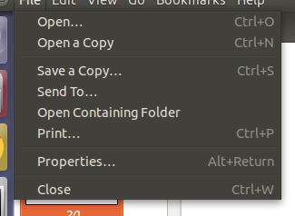
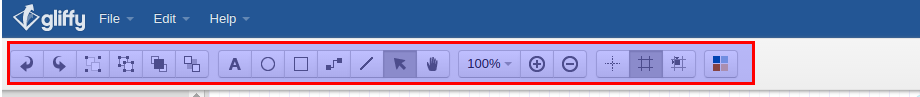
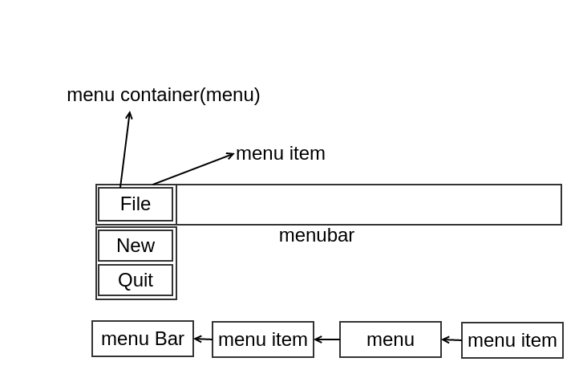
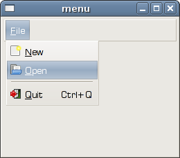

**（一）：写在前面**

在这一小节中，我主要是回顾了GTK+2.0的菜单栏和状态栏的使用。菜单栏(menubar)是GUI程序中最常见的部分之一。我们在日常使用窗口程序的时候，很多我们需要的功能都是在菜单栏和工具栏中获取的。首先我们先来了解一下什么是菜单栏和工具栏。

菜单栏就是我们点击窗口的最上面的按钮的时候弹出的弹出框，其中有好多菜单去提供功能。下面我们看一下我的菜单的截图：



其中最上面盛放File,Edit,View...等内容的就是菜单栏，而File就是菜单，点击File弹出的弹出框中的Open...,Open a Copy...等内容就是菜单条目，每一个菜单条目对应不同的每一个功能。

而工具栏就是每一个工具选项提供一个功能，用户点击相应的工具选项去提供相应的功能。



其中红色部分框起来的就是我们需要的工具栏。

**（二）：菜单栏**

1：菜单栏简单示例

下面我们来实现一个简单的含有文件菜单的菜单栏，文件菜单只有一个菜单条，如果点击这个菜单条程序将退出。

```
#include <gtk/gtk.h>

int main(int argc,char *argv[])
{
    GtkWidget *window;
    GtkWidget *vbox;   //布局方式

    GtkWidget *menubar;   //菜单栏
    GtkWidget *filemenu;  //菜单
    GtkWidget *file;      //容器
    GtkWidget *quit;      //退出菜单条

    gtk_init(&argc,&argv);

    window = gtk_window_new(GTK_WINDOW_TOPLEVEL);
    gtk_window_set_position(GTK_WINDOW(window),GTK_WIN_POS_CENTER);
    gtk_window_set_default_size(GTK_WINDOW(window),250,200);
    gtk_window_set_title(GTK_WINDOW(window),"menu");

    vbox = gtk_vbox_new(FALSE,0);
    gtk_container_add(GTK_CONTAINER(window),vbox);

    menubar = gtk_menu_bar_new();
    filemenu = gtk_menu_new();

    file = gtk_menu_item_new_with_label("File");
    quit = gtk_menu_item_new_with_label("Quit");

    gtk_menu_item_set_submenu(GTK_MENU_ITEM(file),filemenu);
    gtk_menu_shell_append(GTK_MENU_SHELL(filemenu),quit);
    gtk_menu_shell_append(GTK_MENU_SHELL(menubar),file);

    gtk_box_pack_start(GTK_BOX(vbox),menubar,FALSE,FALSE,3);

    g_signal_connect_swapped(G_OBJECT(window),"destroy",G_CALLBACK(gtk_main_quit),NULL);
    g_signal_connect(G_OBJECT(quit),"activate",G_CALLBACK(gtk_main_quit),NULL);

    gtk_widget_show_all(window);

    gtk_main();

    return 0;
}


```

菜单栏和菜单都是源属于同一个构件，就是menu shell。菜单选项(menu items)是一个只对菜单有效的子构件。

下面我们来看一下GTK+2.0的菜单栏组成部分：



2：图像菜单：mnemonics和accelators

有的时候，我们会看到，我们使用菜单栏的时候会看到可以使用快捷键或者是有的菜单项有图像标示，下面我们就要实现带有快捷键的菜单项：

```
#include <gtk/gtk.h>
#include <gdk/gdkkeysyms.h>

int main(int argc,char *argv[])
{
    GtkWidget *window;
    GtkWidget *vbox;

    GtkWidget *menubar;
    GtkWidget *filemenu;
    GtkWidget *file;
    GtkWidget *f_new;
    GtkWidget *open;
    GtkWidget *quit;

    GtkWidget *sep;
    GtkAccelGroup *accel_group = NULL;

    gtk_init(&argc,&argv);


    window = gtk_window_new(GTK_WINDOW_TOPLEVEL);
    gtk_window_set_position(GTK_WINDOW(window),GTK_WIN_POS_CENTER);
    gtk_window_set_default_size(GTK_WINDOW(window),250,200);
    gtk_window_set_title(GTK_WINDOW(window),"menu");

    vbox = gtk_vbox_new(FALSE,0);
    gtk_container_add(GTK_CONTAINER(window),vbox);

    menubar = gtk_menu_bar_new();
    filemenu = gtk_menu_new();

    accel_group = gtk_accel_group_new();
    gtk_window_add_accel_group(GTK_WINDOW(window),accel_group);

    file = gtk_menu_item_new_with_mnemonic("_File");
    f_new = gtk_image_menu_item_new_from_stock(GTK_STOCK_NEW,NULL);
    open = gtk_image_menu_item_new_from_stock(GTK_STOCK_OPEN,NULL);

    sep = gtk_separator_menu_item_new();
    quit = gtk_image_menu_item_new_from_stock(GTK_STOCK_QUIT,accel_group);

    gtk_widget_add_accelerator(quit,"activate",accel_group,GDK_q,GDK_CONTROL_MASK,GTK_ACCEL_VISIBLE);

    gtk_menu_item_set_submenu(GTK_MENU_ITEM(file),filemenu);
    gtk_menu_shell_append(GTK_MENU_SHELL(filemenu),f_new);
    gtk_menu_shell_append(GTK_MENU_SHELL(filemenu),open);
    gtk_menu_shell_append(GTK_MENU_SHELL(filemenu),sep);
    gtk_menu_shell_append(GTK_MENU_SHELL(filemenu),quit);
    gtk_menu_shell_append(GTK_MENU_SHELL(menubar),file);

    gtk_box_pack_start(GTK_BOX(vbox),menubar,FALSE,FALSE,3);

    g_signal_connect_swapped(G_OBJECT(window),"destroy",G_CALLBACK(gtk_main_quit),NULL);

    g_signal_connect(G_OBJECT(quit),"activate",G_CALLBACK(gtk_main_quit),NULL);

    gtk_widget_show_all(window);

    gtk_main();

    return 0;
}

```

不知道为什么我的GTK+2.0不显示菜单栏图像。

下面这张图片是我在我看的书上扒下来的：



3：选择菜单选项

在GTK+2.0中，GtkCheckMenuItem是一个可以生成带有选择的菜单选项。

```
#include <gtk/gtk.h>

void toggle_statusbar(GtkWidget *widget,gpointer statusbar)
{
    if(gtk_check_menu_item_get_active(GTK_CHECK_MENU_ITEM(widget))){
        gtk_widget_show(statusbar);
    }else{
        gtk_widget_hide(statusbar);
    }
}

int main(int argc,char *argv[])
{
    GtkWidget *window;
    GtkWidget *vbox;

    GtkWidget *menubar;
    GtkWidget *viewmenu;
    GtkWidget *view;
    GtkWidget *tog_stat;
    GtkWidget *statusbar;

    gtk_init(&argc,&argv);

    window = gtk_window_new(GTK_WINDOW_TOPLEVEL);
    gtk_window_set_position(GTK_WINDOW(window),GTK_WIN_POS_CENTER);
    gtk_window_set_default_size(GTK_WINDOW(window),250,200);
    gtk_window_set_title(GTK_WINDOW(window),"view statusbar");

    vbox = gtk_vbox_new(FALSE,0);
    gtk_container_add(GTK_CONTAINER(window),vbox);

    menubar = gtk_menu_bar_new();
    viewmenu = gtk_menu_new();

    view = gtk_menu_item_new_with_label("View");
    tog_stat = gtk_check_menu_item_new_with_label("View Statusbar");
    gtk_check_menu_item_set_active(GTK_CHECK_MENU_ITEM(tog_stat),TRUE);

    gtk_menu_item_set_submenu(GTK_MENU_ITEM(view),viewmenu);
    gtk_menu_shell_append(GTK_MENU_SHELL(viewmenu),tog_stat);
    gtk_menu_shell_append(GTK_MENU_SHELL(menubar),view);

    gtk_box_pack_start(GTK_BOX(vbox),menubar,FALSE,FALSE,3);

    statusbar = gtk_statusbar_new();
    gtk_box_pack_end(GTK_BOX(vbox),statusbar,FALSE,TRUE,1);

    g_signal_connect_swapped(G_OBJECT(window),"destroy",G_CALLBACK(gtk_main_quit),NULL);

    g_signal_connect(G_OBJECT(tog_stat),"activate",G_CALLBACK(toggle_statusbar),statusbar);

    gtk_widget_show_all(window);

    gtk_main();

    return 0;
}


```
这里我们制造一个带有选择框的菜单选项。具体的功能为：如果选择框被选中则“状态栏”就会显示出来，反之则不会显示。

函数gtk_check_menu_item_new_with_label()就会生成一个新的带有选择框的菜单选项。

**（三）：写在后面**

在这里我们学习了如何使用菜单栏，后面我们将会学习使用工具栏。


;


