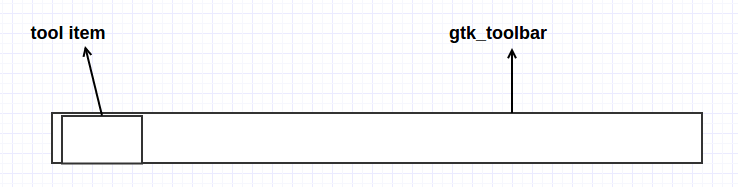
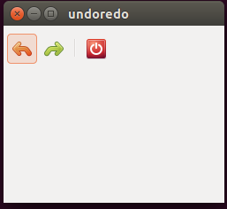
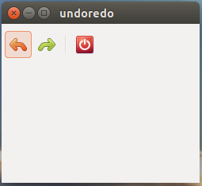
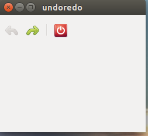
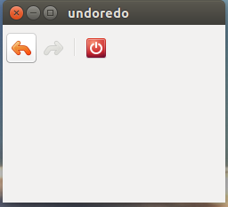

**（一）：写在前面**

在我们上一个小节的学习当中，学习了解了如何使用菜单栏来管理我们的窗口，但是相对来说，GTK+2.0在处理菜单栏的时候有些小麻烦，很容易使人迷惑，不过大体了解一下这个意思就行，只要能够会使用菜单栏就行，如果真是闹不明白他们之间的包含关系，就直接使用之前的代码进行添加就行。然后就是后面我们会学习使用Glade图形接口设计程序来构建我们的界面接口，Glade类似于QT的Qt designer程序一样，这个后面再说。好了，在这一小节中，我们学习使用状态栏，即ToolBar。这个使用比较简单，下面我们看一下他们之间的包含关系：



这里的toolbar的使用就很直接。

好了，话不多说，直接开始我们的学习。

**（二）：工具栏**

*1：初始牛刀* 

下面我们使用一段简单的代码来展示如何构建工具栏：

```
#include <gtk/gtk.h>

int main(int argc,char *argv[])
{
    GtkWidget *window;   /** 窗口 **/
    GtkWidget *vbox;     /** 布局 **/

    GtkWidget *toolbar;  /** 工具栏 **/
    GtkToolItem *f_new;  /** 新建工具选项 **/
    GtkToolItem *open;   /** 打开工具选项 **/
    GtkToolItem *save;   /** 保存工具选项 **/
    GtkToolItem *sep;    /** 分割线 **/
    GtkToolItem *exit;   /** 退出工具选项 **/

    gtk_init(&argc,&argv);

    window = gtk_window_new(GTK_WINDOW_TOPLEVEL);
    gtk_window_set_position(GTK_WINDOW(window),GTK_WIN_POS_CENTER);
    gtk_window_set_default_size(GTK_WINDOW(window),250,200);
    gtk_window_set_title(GTK_WINDOW(window),"toolbar");

    vbox = gtk_vbox_new(FALSE,0);
    gtk_container_add(GTK_CONTAINER(window),vbox);

    toolbar = gtk_toolbar_new();
    gtk_toolbar_set_style(GTK_TOOLBAR(toolbar),GTK_TOOLBAR_ICONS);
    gtk_container_set_border_width(GTK_CONTAINER(toolbar),2);

    f_new = gtk_tool_button_new_from_stock(GTK_STOCK_NEW);
    gtk_toolbar_insert(GTK_TOOLBAR(toolbar),f_new,-1);

    open = gtk_tool_button_new_from_stock(GTK_STOCK_OPEN);
    gtk_toolbar_insert(GTK_TOOLBAR(toolbar),open,-1);

    save = gtk_tool_button_new_from_stock(GTK_STOCK_SAVE);
    gtk_toolbar_insert(GTK_TOOLBAR(toolbar),save,-1);

    sep = gtk_separator_tool_item_new();
    gtk_toolbar_insert(GTK_TOOLBAR(toolbar),sep,-1);

    exit = gtk_tool_button_new_from_stock(GTK_STOCK_QUIT);
    gtk_toolbar_insert(GTK_TOOLBAR(toolbar),exit,-1);

    gtk_box_pack_start(GTK_BOX(vbox),toolbar,FALSE,FALSE,5);

    g_signal_connect(G_OBJECT(exit),"clicked",G_CALLBACK(gtk_main_quit),NULL);
    g_signal_connect_swapped(G_OBJECT(window),"destroy",G_CALLBACK(gtk_main_quit),NULL);

    gtk_widget_show_all(window);
    gtk_main();

    return 0;
}

```

我们先来看一下程序的运行结果：



在上面的代码中，我们制作了一个简单的工具栏：

```
toolbar = gtk_toolbar_new();
gtk_toolbar_set_style(GTK_TOOLBAR(toolbar),GTK_TOOLBAR_ICONS);

```

其中的第一行就是新建一个工具栏，第二行就是设置工具栏的样式，GTK为工具栏设置了很多内置的样式，有图标的样式，文本的样式，图标和文本的样式等等。

```
f_new = gtk_tool_button_new_from_stock(GTK_STOCK_NEW);
gtk_toolbar_insert(GTK_TOOLBAR(toolbar),f_new,-1);
```

其中的第一行就是创建一个新的工具栏按钮，然后我们使用gtk_toolbar_insert()将工具栏按钮天价到工具栏中。

现在我们来看看GTK+ API中的关于gtk_toolbar_insert()的介绍：

	void gtk_toolbar_insert (GtkToolbar *toolbar,
                    GtkToolItem *item,
                    gint pos);
                    
	在位置pos处将工具栏按钮添加到工具栏中。如果pos是0，则工具栏按钮就从工具栏的开始处插入。如果	pos是负数，则工具栏按钮从工具栏后面添加。
    

当然，工具栏的按钮之间也可以使用分割线分开：

```
sep = gtk_separator_tool_item_new();
gtk_toolbar_insert(GTK_TOOLBAR(toolbar),sep,-1);

```

这样通过分组，让用户看上去比较友好一些。

*2：功能失效*

下面我们通过一个例子来展示一个使工具栏中的一个按钮失效的功能。例如：当我们把一篇文章单机保存后，那个保存按钮就会变成阴影状，也就是功能失效了。这个就是为了提示用户：保存功能已经执行过了，不需要再执行保存功能了。

```
#include <gtk/gtk.h>
#include <string.h>

void undo_redo(GtkWidget *widget,gpointer item)
{
    static int count = 2;
    const char *name = gtk_widget_get_name(widget);

    if(strcmp(name,"undo")){
        count++;
    }else{
        count--;
    }

    if(count < 0){
        gtk_widget_set_sensitive(widget,FALSE);
        gtk_widget_set_sensitive(item,TRUE);
    }

    if(count > 5){
        gtk_widget_set_sensitive(widget,FALSE);
        gtk_widget_set_sensitive(item,TRUE);
    }
}

int main(int argc,char *argv[])
{
    GtkWidget *window;
    GtkWidget *vbox;

    GtkWidget *toolbar;
    GtkWidget *undo;
    GtkWidget *redo;
    GtkWidget *sep;
    GtkWidget *exit;

    gtk_init(&argc,&argv);

    window = gtk_window_new(GTK_WINDOW_TOPLEVEL);
    gtk_window_set_position(GTK_WINDOW(window),GTK_WIN_POS_CENTER);
    gtk_window_set_default_size(GTK_WINDOW(window),250,200);
    gtk_window_set_title(GTK_WINDOW(window),"undoredo");

    vbox = gtk_vbox_new(FALSE,0);
    gtk_container_add(GTK_CONTAINER(window),vbox);

    toolbar = gtk_toolbar_new();
    gtk_toolbar_set_style(GTK_TOOLBAR(toolbar),GTK_TOOLBAR_ICONS);
    gtk_container_set_border_width(GTK_CONTAINER(toolbar),2);

    undo = gtk_tool_button_new_from_stock(GTK_STOCK_UNDO);
    gtk_widget_set_name(GTK_WIDGET(undo),"undo");
    gtk_toolbar_insert(GTK_TOOLBAR(toolbar),undo,-1);

    redo = gtk_tool_button_new_from_stock(GTK_STOCK_REDO);
    gtk_toolbar_insert(GTK_TOOLBAR(toolbar),redo,-1);

    sep = gtk_separator_tool_item_new();
    gtk_toolbar_insert(GTK_TOOLBAR(toolbar),sep,-1);

    exit = gtk_tool_button_new_from_stock(GTK_STOCK_QUIT);
    gtk_toolbar_insert(GTK_TOOLBAR(toolbar),exit,-1);

    gtk_box_pack_start(GTK_BOX(vbox),toolbar,FALSE,FALSE,5);

    g_signal_connect(G_OBJECT(undo),"clicked",G_CALLBACK(undo_redo),redo);
    g_signal_connect(G_OBJECT(redo),"clicked",G_CALLBACK(undo_redo),undo);
    g_signal_connect(G_OBJECT(exit),"clicked",G_CALLBACK(gtk_main_quit),NULL);
    g_signal_connect_swapped(G_OBJECT(window),"destroy",G_CALLBACK(gtk_main_quit),NULL);

    gtk_widget_show_all(window);
    gtk_main();

    return 0;
}

```

下面我们来看一下实现效果：

两个按钮都没有失效

后退按钮失效

前进按钮失效


很明显，我们使用'gtk_widget_set_sensitive(item, TRUE);'来设置工具栏按钮是否可用。

**（三）：写在后面**

好了，现在基本的工具栏使用我们已经了解的差不多了，我们可以通过工具栏来实现一些好玩的功能了，后面我们将要学习GTK+2.0的布局功能了。


