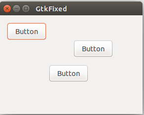
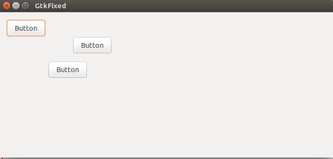
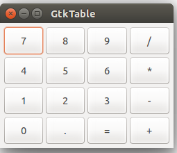
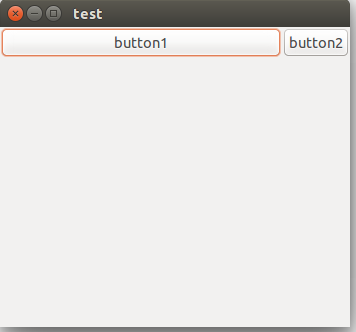
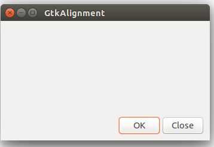
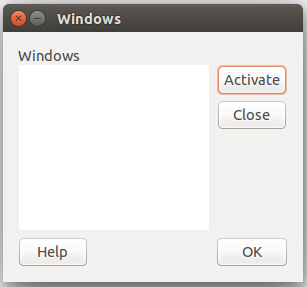

**（一）：写在前面**

在上面的学习中，我们主要是学习了GTK+2.0的关于菜单栏和工具栏的使用方式。在这里，我们主要学习使用在GTK+2.0中的布局，布局在设计应用程序的图形界面的时候，是非常重要的。GTK+2.0中有几个常用的布局管理器。其中有GtkFixed,GtkVBox,GtkHBox,GtkTable和GtkAlignment。现在我们就一个一个的学习了。

**（二）：GtkFixed布局管理器**

容器构件GtkFixed用于布置子构件在一个固定的位置和设定固定的大小。这种构件并不是属于自动的布局关系器。但是，在大多数时候，我们并不使用GtkFixed布局，但是在一些比较特殊的场合，例如，游戏，含有绘图功能的专用软件，那些需要移动和调整大小的软件（如电子表格的图表）等等那些需要使用GtkFixed布局。

下面我们来看一下他的使用方式：

```
#include <gtk/gtk.h>

/**
 * GtkFixed用于布置子构件在一个固定的位置和设定
 * 固定的大小。这种构建并不是属于自动的布局关系器。
 */

 /**
  * 在这个例子中，我们将三个button放到固定的坐标上
  * 即使我们尝试去改变窗口的大小的时候，其中的按钮
  * 的坐标是不变的。
  */

 int main(int argc,char *argv)
 {
    GtkWidget *window;
    GtkWidget *fixed;

    GtkWidget *button1;
    GtkWidget *button2;
    GtkWidget *button3;

    gtk_init(&argc,&argv);

    window = gtk_window_new(GTK_WINDOW_TOPLEVEL);
    gtk_window_set_title(GTK_WINDOW(window),"GtkFixed");
    gtk_window_set_default_size(GTK_WINDOW(window),290,200);
    gtk_window_set_position(GTK_WINDOW(window),GTK_WIN_POS_CENTER);

    fixed = gtk_fixed_new();
    gtk_container_add(GTK_CONTAINER(window),fixed);

    button1 = gtk_button_new_with_label("Button");
    gtk_fixed_put(GTK_FIXED(fixed),button1,150,50);
    gtk_widget_set_size_request(button1,80,35);

    button2 = gtk_button_new_with_label("Button");
    gtk_fixed_put(GTK_FIXED(fixed),button2,15,15);
    gtk_widget_set_size_request(button2,80,35);

    button3 = gtk_button_new_with_label("Button");
    gtk_fixed_put(GTK_FIXED(fixed),button3,100,100);
    gtk_widget_set_size_request(button3,80,35);

    g_signal_connect_swapped(G_OBJECT(window),"destroy",G_CALLBACK(gtk_main_quit),NULL);

    gtk_widget_show_all(window);

    gtk_main();

    return 0;
 }
 
```

在这个例子中，我们生成了三个按钮，这三个按钮设定的是固定的坐标。即使当我们尝试去改变窗口大小的时候，按钮的位置也不会发生改变。

我们来看一下'gtk_fixed_put()'的API:

	void gtk_fixed_put (GtkFixed *fixed,
               GtkWidget *widget,
               gint x,
               gint y);
               
	在给定的位置向GtkFixed容器中添加一个组件。
    
    参数：
    - fixed 	代表GtkFixed
    - widget 	要被添加的组件
    - x			横向上的位置
    - y			纵向上的位置
    
    
下面我们来看一下这段代码的运行结果：





**（三）：GtkVBox布局管理器**

GtkVBox是一种用于垂直布局的容器构件。他把放置在他其中的子构件放置在一个单独的列中。类似的就是GtkHBox也有相似的功能，他俩的区别在于GtkHBox用于水平布局，他的子构件是布置在一个单独的行中的。

下面我们来看一下如何使用该布局：

```
#include <gtk/gtk.h>

/**
 * GtkVBox是用于垂直布局的容器。而GtkHBox是一个水平布局。
 *
 */

 int main(int argc,char *argv[])
 {
    GtkWidget *window;
    GtkWidget *vbox;

    GtkWidget *settings;
    GtkWidget *accounts;
    GtkWidget *loans;
    GtkWidget *cash;
    GtkWidget *debts;

    gtk_init(&argc,&argv);

    window = gtk_window_new(GTK_WINDOW_TOPLEVEL);
    gtk_window_set_position(GTK_WINDOW(window),GTK_WIN_POS_CENTER);
    gtk_window_set_default_size(GTK_WINDOW(window),230,250);
    gtk_window_set_title(GTK_WINDOW(window),"GtkVBox");

    gtk_container_set_border_width(GTK_CONTAINER(window),5);

    vbox = gtk_vbox_new(TRUE,1);
    gtk_container_add(GTK_CONTAINER(window),vbox);

    settings = gtk_button_new_with_label("Settings");
    accounts = gtk_button_new_with_label("Accounts");
    loans = gtk_button_new_with_label("Loans");
    cash = gtk_button_new_with_label("Cash");
    debts = gtk_button_new_with_label("Debts");

    gtk_box_pack_start(GTK_BOX(vbox),settings,TRUE,TRUE,0);
    gtk_box_pack_start(GTK_BOX(vbox),accounts,TRUE,TRUE,0);
    gtk_box_pack_start(GTK_BOX(vbox),loans,TRUE,TRUE,0);
    gtk_box_pack_start(GTK_BOX(vbox),cash,TRUE,TRUE,0);
    gtk_box_pack_start(GTK_BOX(vbox),debts,TRUE,TRUE,0);

    g_signal_connect_swapped(G_OBJECT(window),"destroy",G_CALLBACK(gtk_main_quit),G_OBJECT(window));

    gtk_widget_show_all(window);

    gtk_main();

    return 0;
 }
 
```

我们先来看一下程序的运行结果：


在上面程序中，即使我们改变窗口的大小，其中的按钮也会跟着改变大小。

	1：gtk_vbox_new()的API:
    
    GtkWidget *gtk_vbox_new (gboolean homogeneous,
              gint spacing);
              
	该方法就是为了创建一个新的GtkVBox。
    
    参数：
    - homogeneous: 	如果所有的子构件被给予相同大小的空间布局时为true
    - spacig:		子构件之间的间距

	2：gtk_box_pack_start()的API:
    
    void gtk_box_pack_start (GtkBox *box,
                    GtkWidget *child,
                    gboolean expand,
                    gboolean fill,
                    guint padding);
                 
	向盒子布局中添加一个子构件，从开始打包子构件。也就是从前向后一件一件的添加构件。
    
    参数：
    
     - box：		代表GtkBox盒子
     - child： 	要被添加的子构件
     - expand：	如果子构件被给予额外的空间的话为TRUE
     - fill:	这个参数是和expand一起作用的，如果expand为FALSE的话，这个参数就没有作用。这里的意思是是否填充这个 布局空间
     - padding：	子构件和他的邻居构件之间的空间大小


**（四）：GtkTable布局管理器**

这个布局就是我们编程时候经常用的表格布局，该布局可以按照行也可以按照列来布局他的子构件。

```
#include <gtk/gtk.h>

/**
 * GtkTable布局构件即可以按照行也可以按照列来布局
 *
 */

int main(int argc,char *argv[])
{
    GtkWidget *window;
    GtkWidget *table;

    GtkWidget *button;

    char *values[16] = {"7","8","9","/",
                        "4","5","6","*",
                        "1","2","3","-",
                        "0",".","=","+"
    };

    gtk_init(&argc,&argv);

    window = gtk_window_new(GTK_WINDOW_TOPLEVEL);
    gtk_window_set_position(GTK_WINDOW(window),GTK_WIN_POS_CENTER);
    gtk_window_set_default_size(GTK_WINDOW(window),250,180);
    gtk_window_set_title(GTK_WINDOW(window),"GtkTable");

    gtk_container_set_border_width(GTK_CONTAINER(window),5);

    table = gtk_table_new(4,4,TRUE);
    gtk_table_set_row_spacings(GTK_TABLE(table),2);
    gtk_table_set_col_spacings(GTK_TABLE(table),2);

    int i = 0;
    int j = 0;
    int pos = 0;

    for(i = 0;i < 4;i++){
        for(j = 0;j < 4;j++){
            button = gtk_button_new_with_label(values[pos]);
            gtk_table_attach_defaults(GTK_TABLE(table),button,j,j+1,i,i+1);

            pos++;
        }
    }

    gtk_container_add(GTK_CONTAINER(window),table);

    g_signal_connect_swapped(G_OBJECT(window),"destroy",G_CALLBACK(gtk_main_quit),G_OBJECT(window));

    gtk_widget_show_all(window);

    gtk_main();

    return 0;
}

```

在这里我们构件了一个计算机的按钮布局，我们来看一下：



当然我们也可以使用下面的方式来使我们的子构件来占用表格中的多个格子：

```
#include <gtk/gtk.h>

int main(int argc,char *argv[])
{
    GtkWidget *window;
    GtkTable *table;

    GtkWidget *button1;
    GtkWidget *button2;

    gtk_init(&argc,&argv);

    window = gtk_window_new(GTK_WINDOW_TOPLEVEL);
    gtk_window_set_title(GTK_WINDOW(window),"test");
    gtk_window_set_default_size(GTK_WINDOW(window),350,300);
    gtk_window_set_position(GTK_WINDOW(window),GTK_WIN_POS_CENTER);

    table = gtk_table_new(5,5,FALSE);

    button1 = gtk_button_new_with_label("button1");
    button2 = gtk_button_new_with_label("button2");

    gtk_table_attach(GTK_TABLE(table),button1,0,4,0,1,GTK_FILL | GTK_EXPAND,GTK_FILL,1,1);
    gtk_table_set_col_spacing(GTK_TABLE(table),0,4);
    gtk_table_attach(GTK_TABLE(table),button2,4,5,0,1,GTK_FILL,GTK_FILL,1,1);

    gtk_container_add(GTK_CONTAINER(window),table);

    g_signal_connect_swapped(G_OBJECT(window),"destroy",G_CALLBACK(gtk_main_quit),G_OBJECT(window));

    gtk_widget_show_all(window);
    gtk_main();

    return 0;
}

```



通过比较，我们可以看到，为了能够使子控件能够占用多个格子的话，就需要使用GTK_EXPAND参数。

**（五）：GtkAlignment布局方式**

GtkAlignment容器构件控制了她的子构件的对齐方式。

```
#include <gtk/gtk.h>

/**
 * GtkAlignment容器构件控制了他的子构件的对齐方式和大小
 *
 */

 int main(int argc,char *argv[])
 {
    GtkWidget *window;
    GtkWidget *ok;
    GtkWidget *close;
    GtkWidget *vbox;
    GtkWidget *hbox;
    GtkWidget *halign;
    GtkWidget *valign;

    gtk_init(&argc,&argv);

    window = gtk_window_new(GTK_WINDOW_TOPLEVEL);
    gtk_window_set_position(GTK_WINDOW(window),GTK_WIN_POS_CENTER);
    gtk_window_set_default_size(GTK_WINDOW(window),350,200);
    gtk_window_set_title(GTK_WINDOW(window),"GtkAlignment");
    gtk_container_set_border_width(GTK_CONTAINER(window),10);

    vbox = gtk_vbox_new(FALSE,5);

    valign = gtk_alignment_new(0,1,0,0);
    gtk_container_add(GTK_CONTAINER(vbox),valign);
    gtk_container_add(GTK_CONTAINER(window),vbox);

    hbox = gtk_hbox_new(TRUE,3);

    ok = gtk_button_new_with_label("OK");
    gtk_widget_set_size_request(ok,70,30);
    gtk_container_add(GTK_CONTAINER(hbox),ok);
    close = gtk_button_new_with_label("Close");
    gtk_container_add(GTK_CONTAINER(hbox),close);

    halign = gtk_alignment_new(1,0,0,0);
    gtk_container_add(GTK_CONTAINER(halign),hbox);

    gtk_box_pack_start(GTK_BOX(vbox),halign,FALSE,FALSE,0);

    g_signal_connect_swapped(G_OBJECT(window),"destroy",G_CALLBACK(gtk_main_quit),G_OBJECT(window));

    gtk_widget_show_all(window);

    gtk_main();

    return 0;
 }
 
```
在这个程序中，我们把两个按钮布局在了一个窗口的右下角，为了实现这个效果，我们使用一个水平盒子构件GtkHBox，一个垂直盒子构件GtkVBox和两个对其容器构件。

这个实现比较简单。

大家看一下生成的效果，还是挺好看的：



**（六）：综合使用**

下面我们使用上面介绍到的布局方式来实现一个窗口布局，这个实现方式也不是很难，但是听常用的，大家可以看一下最后实现的效果：



下面我们来看看我们是如何使用代码来实现这个效果的吧。

```
#include <gtk/gtk.h>

/**
 * 在这里实现一个比较全面的窗口程序
 *
 */

 int main(int argc,char *argv[])
 {
    GtkWidget *window;
    GtkWidget *table;

    GtkWidget *title;
    GtkWidget *activate;
    GtkWidget *halign;
    GtkWidget *halign2;

    GtkWidget *valign;
    GtkWidget *close;
    GtkWidget *wins;

    GtkWidget *help;
    GtkWidget *ok;

    gtk_init(&argc,&argv);

    window = gtk_window_new(GTK_WINDOW_TOPLEVEL);
    gtk_window_set_position(GTK_WINDOW(window),GTK_WIN_POS_CENTER);
    gtk_widget_set_size_request(window,300,250);
    gtk_window_set_resizable(GTK_WINDOW(window),FALSE);

    gtk_window_set_title(GTK_WINDOW(window),"Windows");

    gtk_container_set_border_width(GTK_CONTAINER(window),15);

    table = gtk_table_new(8,4,FALSE);
    gtk_table_set_col_spacings(GTK_TABLE(table),3);

    title = gtk_label_new("Windows");
    halign = gtk_alignment_new(0,0,0,0);
    gtk_container_add(GTK_CONTAINER(halign),title);
    gtk_table_attach(GTK_TABLE(table),halign,0,1,0,1,GTK_FILL,GTK_FILL,0,0);

    wins = gtk_text_view_new();
    gtk_text_view_set_editable(GTK_TEXT_VIEW(wins),FALSE);
    gtk_text_view_set_cursor_visible(GTK_TEXT_VIEW(wins),FALSE);
    gtk_table_attach(GTK_TABLE(table),wins,0,2,1,3,GTK_FILL | GTK_EXPAND,GTK_FILL | GTK_EXPAND,1,1);

    activate = gtk_button_new_with_label("Activate");
    gtk_widget_set_size_request(activate,50,30);
    gtk_table_attach(GTK_TABLE(table),activate,3,4,1,2,GTK_FILL,GTK_SHRINK,1,1);

    valign = gtk_alignment_new(0,0,0,0);
    close = gtk_button_new_with_label("Close");
    gtk_widget_set_size_request(close,70,30);

    gtk_container_add(GTK_CONTAINER(valign),close);
    gtk_table_set_row_spacing(GTK_TABLE(table),1,3);
    gtk_table_attach(GTK_TABLE(table),valign,3,4,2,3,GTK_FILL,GTK_FILL | GTK_EXPAND,1,1);


    halign2 = gtk_alignment_new(0,1,0,0);
    help = gtk_button_new_with_label("Help");

    gtk_container_add(GTK_CONTAINER(halign2),help);
    gtk_widget_set_size_request(help,70,30);
    gtk_table_set_row_spacing(GTK_TABLE(table),3,6);
    gtk_table_attach(GTK_TABLE(table),halign2,0,1,4,5,GTK_FILL,GTK_FILL,0,0);

    ok = gtk_button_new_with_label("OK");
    gtk_widget_set_size_request(ok,70,30);
    gtk_table_attach(GTK_TABLE(table),ok,3,4,4,5,GTK_FILL,GTK_FILL,0,0);

    gtk_container_add(GTK_CONTAINER(window),table);

    g_signal_connect_swapped(G_OBJECT(window),"destroy",G_CALLBACK(gtk_main_quit),G_OBJECT(window));

    gtk_widget_show_all(window);

    gtk_main();

    return 0;
 }

```

后面我们在实际项目实战的时候，会经常使用到这些布局。

**（七）：写在后面**

在这里，我们将常用的布局管理器学习了一下，后面我们主要学习GTK+2.0中比价重要的一部分，就是事件和信号。


