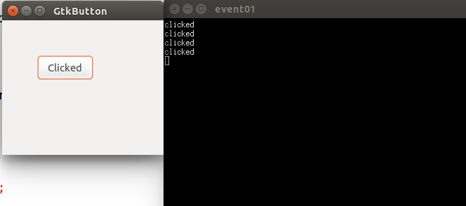
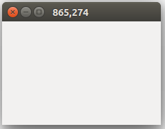
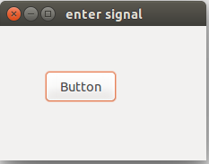
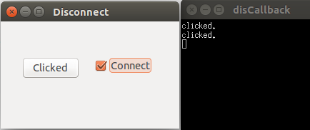
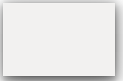
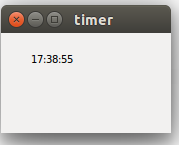

**（一）：写在前面**

在这一个小节中，我们主要是学习GTK+2.0中最重要的部分，就是信号和事件。GTK+函数工具库是基于“事件”系统的。所有的GUI应用都是基于“事件”驱动的。如果没有“事件”发生，那么应用程序就无法正常运行。在GTK+中一个事件就是从X窗口服务器传过来的一个消息。当一个“事件”发生的时候，她就会通过发送一个“信号”来表示它已经做除了反应。当然，利用GTK+还可以为“信号”绑定专门的回调函数，即回调函数只对他绑定的信号才有反应。

下面我们来看一个最常用的信号处理：

```
#include <gtk/gtk.h>

void button_clicked(GtkWidget *widget,gpointer data)
{
    g_print("clicked\n");
}

int main(int argc,char *argv[])
{
    GtkWidget *window;
    GtkWidget *fixed;
    GtkWidget *button;

    gtk_init(&argc,&argv);

    window = gtk_window_new(GTK_WINDOW_TOPLEVEL);
    gtk_window_set_title(GTK_WINDOW(window),"GtkButton");
    gtk_window_set_default_size(GTK_WINDOW(window),230,150);
    gtk_window_set_position(GTK_WINDOW(window),GTK_WIN_POS_CENTER);

    fixed = gtk_fixed_new();
    gtk_container_add(GTK_CONTAINER(window),fixed);

    button = gtk_button_new_with_label("Clicked");
    gtk_fixed_put(GTK_FIXED(fixed),button,50,50);
    gtk_widget_set_size_request(button,80,35);

    g_signal_connect(G_OBJECT(button),"clicked",G_CALLBACK(button_clicked),NULL);

    g_signal_connect(G_OBJECT(window),"destroy",G_CALLBACK(gtk_main_quit),NULL);

    gtk_widget_show_all(window);

    gtk_main();


    return 0;
}

```

这里是当用户点击Button的时候，会在控制台打印clicked字符串。

我们来看一下运行效果：



在这个应用程序中，有两个“信号”。一个信号是clicked，另外一个信号是destroy。

我们使用函数g_signal_connect()去连接信号"clicked"和回调函数button_clickec()。

这个回调函数的功能是向终端输出"clicked"字符串。这个函数的第一个参数就是发出信号的对象，第二个参数是可选参数，使用这个参数向回调函数传递特定数据。在这里我们并没有传递任何数据，所以就传入NULL。

**（二）：移动窗口**

下面这个例子，我们将要实现对"窗口移动"进行监听，为该事件做出反应。

```
#include <gtk/gtk.h>

void frame_callback(GtkWidget *window,GdkEvent *event,gpointer data)
{
    int x,y;
    char buf[10];

    x = event->configure.x;
    y = event->configure.y;

    sprintf(buf,"%d,%d",x,y);

    gtk_window_set_title(window,buf);
}

int main(int argc,char *argv[])
{
    GtkWidget *window;

    gtk_init(&argc,&argv);

    window = gtk_window_new(GTK_WINDOW_TOPLEVEL);
    gtk_window_set_position(GTK_WINDOW(window),GTK_WIN_POS_CENTER);
    gtk_window_set_default_size(GTK_WINDOW(window),230,150);
    gtk_window_set_title(GTK_WINDOW(window),"Simple");
    gtk_widget_add_events(GTK_WIDGET(window),GDK_CONFIGURE);

    g_signal_connect_swapped(G_OBJECT(window),"destroy",G_CALLBACK(gtk_main_quit),G_OBJECT(window));

    g_signal_connect(G_OBJECT(window),"configure-event",G_CALLBACK(frame_callback),NULL);

    gtk_widget_show_all(window);

    gtk_main();

    return 0;
}

```

下面我们来看一下运行效果：



当我们移动窗口的时候，我们随时会看到窗口标题栏上的窗口的位置。

```
gtk_widget_add_events(GTK_WIDGET(window),GDK_CONFIGURE);
```
上面的代码说明了，哪一个构件将会接受到事件，并且对事情的发生做出反应。一些事情使用的时候要已与特定的构件组装好，另外的一些事件不得不要用一个函数gtk_widget_events()来绑定，把事件类型GDK_CONFIGURE添加到函数中。事件类型GDK_CONFIGURE包含了所有的大小，位置和用于存储事件次序的栈结构。

```
g_signal_connect(G_OBJECT(window),"configure-event",G_CALLBACK(frame_callback),NULL);

```

这样，当信号"configure-event"被发送的时候，则被绑定的组件的打下，位置与次序栈都被捕获了。这样就可以在回调函数中进行处理了。

**（三）：鼠标进入信号**

在这个例子中，我们会展示如何对“鼠标的进入”信号做出反应。当我们的鼠标移动到我们所绑定的那个构件上的时候会发出“鼠标进入信号”。

```
#include <gtk/gtk.h>

void enter_button(GtkWidget *widget,gpointer data)
{
    GdkColor color;
    color.red = 27000;
    color.green = 30325;
    color.blue = 34181;

    gtk_widget_modify_bg(widget,GTK_STATE_PRELIGHT,&color);
}


int main(int argc,char *argv[])
{
    GtkWidget *window;
    GtkWidget *fixed;
    GtkWidget *button;

    gtk_init(&argc,&argv);

    window = gtk_window_new(GTK_WINDOW_TOPLEVEL);
    gtk_window_set_position(GTK_WINDOW(window),GTK_WIN_POS_CENTER);
    gtk_window_set_default_size(GTK_WINDOW(window),230,150);
    gtk_window_set_title(GTK_WINDOW(window),"enter signal");

    fixed = gtk_fixed_new();
    gtk_container_add(GTK_CONTAINER(window),fixed);

    button = gtk_button_new_with_label("Button");
    gtk_widget_set_size_request(button,80,35);
    gtk_fixed_put(GTK_FIXED(fixed),button,50,50);

    g_signal_connect(G_OBJECT(button),"enter",G_CALLBACK(enter_button),NULL);

    g_signal_connect_swapped(G_OBJECT(window),"destroy",G_CALLBACK(gtk_main_quit),NULL);

    gtk_widget_show_all(window);

    gtk_main();

    return 0;
}

```

下面我们来看一下运行结果：



当鼠标进入按钮区域之后，按钮的背景颜色就会发生变化。

```
g_signal_connect(G_OBJECT(button),"enter",G_CALLBACK(enter_button),NULL);

```

当"enter"发生的时候，我们会调用函数enter_button()。

```
void enter_button(GtkWidget *widget,gpointer data)
{
    GdkColor color;
    color.red = 27000;
    color.green = 30325;
    color.blue = 34181;

    gtk_widget_modify_bg(widget,GTK_STATE_PRELIGHT,&color);
}

```

在对应的回调函数中，我们通过调用函数gtk_widget_modify_bg()来改变按钮的颜色。

**（四）：回调函数解除绑定**

有的时候我们为一个信号绑定一个回调函数的时候，我们需要解除绑定，下面这个例子我们就展示如何解除绑定：

```
#include <gtk/gtk.h>

int handler_id;

void button_clicked(GtkWidget *widget,gpointer data)
{
    g_print("clicked.\n");
}

void toggle_signal(GtkWidget *widget,gpointer window)
{
    if(gtk_toggle_button_get_active(GTK_TOGGLE_BUTTON(widget))){
        handler_id = g_signal_connect(G_OBJECT(window),"clicked",G_CALLBACK(button_clicked),NULL);
    }else{
        g_signal_handler_disconnect(window,handler_id);
    }
}


int main(int argc,char *argv[])
{
    GtkWidget *window;
    GtkWidget *fixed;
    GtkWidget *button;

    GtkWidget *check;

    gtk_init(&argc,&argv);

    window = gtk_window_new(GTK_WINDOW_TOPLEVEL);
    gtk_window_set_position(GTK_WINDOW(window),GTK_WIN_POS_CENTER);
    gtk_window_set_default_size(GTK_WINDOW(window),250,150);
    gtk_window_set_title(GTK_WINDOW(window),"Disconnect");

    fixed = gtk_fixed_new();
    gtk_container_add(GTK_CONTAINER(window),fixed);

    button = gtk_button_new_with_label("Clicked");
    gtk_widget_set_size_request(button,80,30);
    gtk_fixed_put(GTK_FIXED(fixed),button,30,50);

    check = gtk_check_button_new_with_label("Connect");
    gtk_toggle_button_set_active(GTK_TOGGLE_BUTTON(check),TRUE);
    gtk_fixed_put(GTK_FIXED(fixed),check,130,50);

    handler_id = g_signal_connect(G_OBJECT(button),"clicked",G_CALLBACK(button_clicked),NULL);

    g_signal_connect(G_OBJECT(check),"clicked",G_CALLBACK(toggle_signal),(gpointer)button);

    g_signal_connect_swapped(G_OBJECT(window),"destroy",G_CALLBACK(gtk_main_quit),NULL);

    gtk_widget_show_all(window);

    gtk_main();


    return 0;
}

```

下面我们先来看一下运行结果：



我们有一个按钮和一个选择框，选择框的功能就是绑定或者是解除绑定一个回调信号与信号"clicked"之间的关系。

```
handler_id = g_signal_connect(G_OBJECT(button),"clicked",G_CALLBACK(button_clicked),NULL);

```

g_signal_connect()函数执行后会返回一个“id”数据，这个id是信号和回调函数绑定的唯一标示。

当选择框选上的时候，就绑定信号，如果未选中的时候，就解除绑定。

**（五）：拖与放实例**

在这个例子中，我们将会展示一个没有边框的窗口，我们如何对他进行拖动与放置呢?

```
#include <gtk/gtk.h>

gboolean on_button_press(GtkWidget *widget,GdkEventButton *event,GdkWindowEdge edge)
{
    if(event->type == GDK_BUTTON_PRESS)
    {
        if(event->button == 1){

            gtk_window_begin_move_drag(GTK_WINDOW(gtk_widget_get_toplevel(widget)),
            event->button,event->x_root,event->y_root,event->time);
        }
    }

    return FALSE;
}


int main(int argc,char *argv[])
{
    GtkWidget *window;

    gtk_init(&argc,&argv);

    window = gtk_window_new(GTK_WINDOW_TOPLEVEL);
    gtk_window_set_position(GTK_WINDOW(window),GTK_WIN_POS_CENTER);
    gtk_window_set_default_size(GTK_WINDOW(window),230,150);
    gtk_window_set_title(GTK_WINDOW(window),"Drag & Drop");
    gtk_window_set_decorated(GTK_WINDOW(window),FALSE);
    gtk_widget_add_events(window,GDK_BUTTON_PRESS_MASK);

    g_signal_connect(G_OBJECT(window),"button-press-event",G_CALLBACK(on_button_press),NULL);

    g_signal_connect_swapped(G_OBJECT(window),"destroy",G_CALLBACK(gtk_main_quit),G_OBJECT(window));

    gtk_widget_show(window);

    gtk_main();

    return 0;
}

```

我们来看一下运行效果：



```
gtk_window_set_decorated(GTK_WINDOW(window),FALSE);
```

通过这个函数我们去除了窗口中的修饰性部分。

```
g_signal_connect(G_OBJECT(window),"button-press-event",G_CALLBACK(on_button_press),NULL);

```

我们把信号button-press-event绑定在窗口中，在回调函数on_button_press()中，我们放置了拖动和放置的代码。我们检测鼠标左键是否被单击。然后条件判断执行函数gtk_window_begin_move_drag()进行拖放操作。

**（六）：定时器**

最后，我们实现一个定时器功能，这个还是比价有意思的：

```
#include <cairo.h>
#include <gtk/gtk.h>
#include <time.h>

static char buffer[256];

static gboolean on_expose_event(GtkWidget *widget,GdkEventExpose *event,gpointer data)
{
    cairo_t *cr;

    cr = gdk_cairo_create(widget->window);

    cairo_move_to(cr,30,30);
    cairo_show_text(cr,buffer);

    cairo_destroy(cr);

    return FALSE;
}

static gboolean time_handler(GtkWidget *widget)
{
    if(widget->window == NULL) return FALSE;

    time_t curtime;
    struct tm *loctime;

    curtime = time(NULL);
    loctime = localtime(&curtime);
    strftime(buffer,256,"%T",loctime);

    gtk_widget_queue_draw(widget);

    return TRUE;

}

int main(int argc,char *argv[])
{
    GtkWidget *window;
    GtkWidget *darea;

    gtk_init(&argc,&argv);

    window = gtk_window_new(GTK_WINDOW_TOPLEVEL);

    darea = gtk_drawing_area_new();

    gtk_container_add(GTK_CONTAINER(window),darea);

    g_signal_connect(darea,"expose-event",G_CALLBACK(on_expose_event),NULL);

    g_signal_connect(window,"destroy",G_CALLBACK(gtk_main_quit),NULL);

    gtk_window_set_position(GTK_WINDOW(window),GTK_WIN_POS_CENTER);
    gtk_window_set_default_size(GTK_WINDOW(window),170,100);

    gtk_window_set_title(GTK_WINDOW(window),"timer");

    g_timeout_add(1000,(GSourceFunc)time_handler,(gpointer)window);

    gtk_widget_show_all(window);

    time_handler(window);

    gtk_main();

    return 0;
}

```

下面是运行效果：



在窗口中，我们画一个显示当前事件的动态效果，工具就是Cairo函数工具库。

```
g_signal_connect(darea,"expose-event",G_CALLBACK(on_expose_event),NULL);
```

首先，我们把回调函数on_expose_event()中画出时间的数值。该回调函数与信号进行了绑定exposed-event。当信号发送的时候，窗口就会调用回调函数进行更新数据。

```
g_timeout_add(1000,(GSourceFunc)time_handler,(gpointer)window);
```

上面的函数注册了一个GTK+系统中的一个定时器。函数time_handler()就会按照函数的设置不断更新。

有关与Cairo函数库后面我们会


