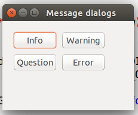
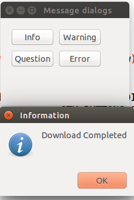
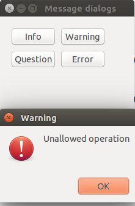
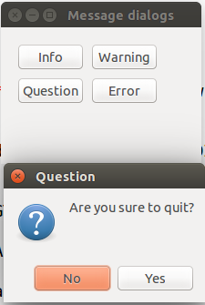
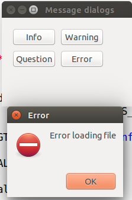
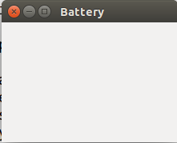
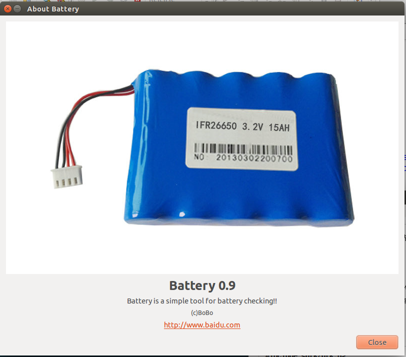
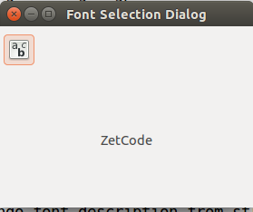
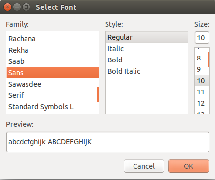
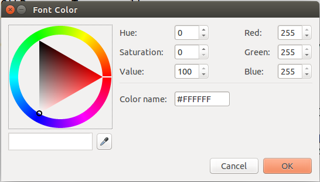

**（一）：写在前面**
<hr />

在这一个小节中，我们主要学习的是GTK+中的对话框。对话框窗口是众多GUI应用程序中不可或缺的部分。对话框是经常在窗口应用中使用的。对话框可以用来输入数据，修改数据，或者是改变应用程序的使用设置信息等等。下面我们就通过分类来讲解如何使用各种类型的对话框。

**（二）：消息对话框**
<hr />

消息对话框可以方便在我们的应用程序中，跳出来显示一些有用的信息，其中也可以包含文字或者图像。

下面我们来看一个例子：

```
#include <gtk/gtk.h>

/**
 * 信息对话框
 */

void show_info(GtkWidget *widget,gpointer window)
{
    GtkWidget *dialog;
    dialog = gtk_message_dialog_new(window,GTK_DIALOG_DESTROY_WITH_PARENT,GTK_MESSAGE_INFO,
                                    GTK_BUTTONS_OK,"Download Completed","title");

    gtk_window_set_title(GTK_WINDOW(dialog),"Information");

    gtk_dialog_run(GTK_DIALOG(dialog));

    gtk_widget_destroy(dialog);
}

/**
 * 错误对话框
 */
void show_error(GtkWidget *widget,gpointer window)
{
    GtkWidget *dialog;

    dialog = gtk_message_dialog_new(window,GTK_DIALOG_DESTROY_WITH_PARENT,
                                    GTK_MESSAGE_ERROR,GTK_BUTTONS_OK,"Error loading file");
    gtk_window_set_title(GTK_WINDOW(dialog),"Error");
    gtk_dialog_run(GTK_DIALOG(dialog));

    gtk_widget_destroy(dialog);
}

/**
 * 错误对话框
 */
void show_question(GtkWidget *widget,gpointer window)
{
    GtkWidget *dialog;

    dialog = gtk_message_dialog_new(window,GTK_DIALOG_DESTROY_WITH_PARENT,
                                    GTK_MESSAGE_QUESTION,GTK_BUTTONS_YES_NO,"Are you sure to quit?");
    gtk_window_set_title(GTK_WINDOW(dialog),"Question");
    gtk_dialog_run(GTK_DIALOG(dialog));

    gtk_widget_destroy(dialog);
}

/**
 * 警告对话框
 */
void show_warning(GtkWidget *widget,gpointer window)
{

    GtkWidget *dialog;

    dialog = gtk_message_dialog_new(window,GTK_DIALOG_DESTROY_WITH_PARENT,
                                    GTK_MESSAGE_WARNING,GTK_BUTTONS_OK,"Unallowed operation");
    gtk_window_set_title(GTK_WINDOW(dialog),"Warning");
    gtk_dialog_run(GTK_DIALOG(dialog));

    gtk_widget_destroy(dialog);
}

int main(int argc,char *argv[])
{

    GtkWidget *window;
    GtkWidget *table;

    GtkWidget *info;
    GtkWidget *warn;
    GtkWidget *que;
    GtkWidget *err;

    gtk_init(&argc,&argv);

    window = gtk_window_new(GTK_WINDOW_TOPLEVEL);
    gtk_window_set_position(GTK_WINDOW(window),GTK_WIN_POS_CENTER);
    gtk_window_set_default_size(GTK_WINDOW(window),220,150);
    gtk_window_set_title(GTK_WINDOW(window),"Message dialogs");

    table = gtk_table_new(2,2,TRUE);
    gtk_table_set_row_spacings(GTK_TABLE(table),2);
    gtk_table_set_col_spacings(GTK_TABLE(table),2);

    info = gtk_button_new_with_label("Info");
    warn = gtk_button_new_with_label("Warning");
    que = gtk_button_new_with_label("Question");
    err = gtk_button_new_with_label("Error");

    gtk_table_attach(GTK_TABLE(table),info,0,1,0,1,GTK_FILL,GTK_FILL,3,3);
    gtk_table_attach(GTK_TABLE(table),warn,1,2,0,1,GTK_FILL,GTK_FILL,3,3);
    gtk_table_attach(GTK_TABLE(table),que,0,1,1,2,GTK_FILL,GTK_FILL,3,3);
    gtk_table_attach(GTK_TABLE(table),err,1,2,1,2,GTK_FILL,GTK_FILL,3,3);

    gtk_container_add(GTK_CONTAINER(window),table);
    gtk_container_set_border_width(GTK_CONTAINER(window),15);

    g_signal_connect(G_OBJECT(info),"clicked",G_CALLBACK(show_info),(gpointer)window);
    g_signal_connect(G_OBJECT(warn),"clicked",G_CALLBACK(show_warning),(gpointer)window);
    g_signal_connect(G_OBJECT(que),"clicked",G_CALLBACK(show_question),(gpointer)window);
    g_signal_connect(G_OBJECT(err),"clicked",G_CALLBACK(show_error),(gpointer)window);

    g_signal_connect_swapped(G_OBJECT(window),"destroy",G_CALLBACK(gtk_main_quit),G_OBJECT(window));

    gtk_widget_show_all(window);

    gtk_main();

    return 0;
}

```

这里的几个对话框都是我们在编写程序的常用的，包括问题对话框，警告对话框，消息对话框，错误对话框；我们来看一下我们这个程序的运行效果：











在上面的例子中，我们展示了四种消息对话框。Information,Warning,Question和Error消息对话框。

```
gtk_message_dialog_new(window,GTK_DIALOG_DESTROY_WITH_PARENT,GTK_MESSAGE_INFO,
                                    GTK_BUTTONS_OK,"Download Completed","title");
                                    
```

在函数show_question()中，我们构件了一个对话框。而`gtk_message_dialog_new()`函数正是创建消息对话框的方法。在函数中的参数设置是在说明我们显示那种样式的对话框。系统常量`GTK_MESSAGE_INFO`是在说明我们想要生成info对话框。系统常量`GTK_BUTTONS_OK`将生成一个"ok"按钮，最后一个参数是我们想要在对话框中显示的文字。

```
	gtk_window_set_title(GTK_WINDOW(dialog),"Warning");
    gtk_dialog_run(GTK_DIALOG(dialog));

    gtk_widget_destroy(dialog);
    
```

在这里，主要是对生成的对话框进行设置，先设置标题，接着运行这个对话框，最后设置该对话框必须手动关闭。

**（三）：GTK应用程序信息对话框**
<hr />

GTK应用程序对话框是用来显示应用程序中的有关提示信息的。GTK应用程序对话框可以显示应用程序的logo,名称，版本，版权，网站或者认证之类的信息，中间当然也可以添加一些别的信息。

下面我们举个例子：

```
#include <gtk/gtk.h>

void show_about(GtkWidget *widget,gpointer data)
{
    GdkPixbuf *pixbuf = gdk_pixbuf_new_from_file("battery.jpg",NULL);

    GtkWidget *dialog = gtk_about_dialog_new();
    gtk_about_dialog_set_name(GTK_ABOUT_DIALOG(dialog),"Battery");
    gtk_about_dialog_set_version(GTK_ABOUT_DIALOG(dialog),"0.9");
    gtk_about_dialog_set_copyright(GTK_ABOUT_DIALOG(dialog),"(c)BoBo");
    gtk_about_dialog_set_comments(GTK_ABOUT_DIALOG(dialog),"Battery is a simple tool for battery checking!!");
    gtk_about_dialog_set_website(GTK_ABOUT_DIALOG(dialog),"http://www.baidu.com");
    gtk_about_dialog_set_logo(GTK_ABOUT_DIALOG(dialog),pixbuf);

    g_object_unref(pixbuf),pixbuf = NULL;
    gtk_dialog_run(GTK_DIALOG(dialog));
    gtk_widget_destroy(dialog);
}

int main(int argc,char *argv[])
{
    GtkWidget *window;

    gtk_init(&argc,&argv);

    window = gtk_window_new(GTK_WINDOW_TOPLEVEL);
    gtk_window_set_position(GTK_WINDOW(window),GTK_WIN_POS_CENTER);
    gtk_window_set_default_size(GTK_WINDOW(window),220,150);
    gtk_window_set_title(GTK_WINDOW(window),"Battery");

    gtk_container_set_border_width(GTK_CONTAINER(window),15);
    gtk_widget_add_events(window,GDK_BUTTON_PRESS_MASK);

    g_signal_connect(G_OBJECT(window),"button-press-event",G_CALLBACK(show_about),(gpointer)window);

    g_signal_connect_swapped(G_OBJECT(window),"destroy",G_CALLBACK(gtk_main_quit),G_OBJECT(window));

    gtk_widget_show_all(window);

    gtk_main();

    return 0;
}

```

上面的代码中我们用了构件GtkAboutDialog以及该构件的一些特性。当我们单击应用程序窗口的时候，该GTK应用程序信息对话框就会跳出来。

我们先来看一下运行效果：





我们使用`gtk_about_dialog_new()`函数来生成一个新的GtkAboutDialog构件，接着我们再通过一些方法函数来为对话框进行设置，这些设置函数还是看上去比较简单的，使用起来也非常方便。


**（四）：GTK字体选择对话框**
<hr />

GTK字体选择对话框是用来选择字体的，这个对话框也是我们常用的。该对话框在一些应用程序中很有代表性，尤其是一些文字处理或者文字排版软件。

```
#include <gtk/gtk.h>


void select_font(GtkWidget *widget,gpointer label)
{
    GtkResponseType result;
    GtkWidget *dialog = gtk_font_selection_dialog_new("Select Font");
    result = gtk_dialog_run(GTK_DIALOG(dialog));

    if(result == GTK_RESPONSE_OK || result == GTK_RESPONSE_APPLY)
    {
        PangoFontDescription *font_desc;

        gchar *fontname = gtk_font_selection_dialog_get_font_name(GTK_FONT_SELECTION_DIALOG(dialog));
        font_desc = pango_font_description_from_string(fontname);

        gtk_widget_modify_font(GTK_WIDGET(label),font_desc);

        g_free(fontname);
    }

    gtk_widget_destroy(dialog);

}

int main(int argc,char *argv[])
{
    GtkWidget *window;
    GtkWidget *label;
    GtkWidget *vbox;

    GtkWidget *toolbar;
    GtkToolItem *font;

    gtk_init(&argc,&argv);

    window = gtk_window_new(GTK_WINDOW_TOPLEVEL);
    gtk_window_set_position(GTK_WINDOW(window),GTK_WIN_POS_CENTER);
    gtk_window_set_default_size(GTK_WINDOW(window),280,200);
    gtk_window_set_title(GTK_WINDOW(window),"Font Selection Dialog");

    vbox = gtk_vbox_new(FALSE,0);
    gtk_container_add(GTK_CONTAINER(window),vbox);

    toolbar = gtk_toolbar_new();
    gtk_toolbar_set_style(GTK_TOOLBAR(toolbar),GTK_TOOLBAR_ICONS);

    gtk_container_set_border_width(GTK_CONTAINER(toolbar),2);

    font = gtk_tool_button_new_from_stock(GTK_STOCK_SELECT_FONT);
    gtk_toolbar_insert(GTK_TOOLBAR(toolbar),font,-1);

    gtk_box_pack_start(GTK_BOX(vbox),toolbar,FALSE,FALSE,5);

    label = gtk_label_new("ZetCode");
    gtk_label_set_justify(GTK_LABEL(label),GTK_JUSTIFY_CENTER);
    gtk_box_pack_start(GTK_BOX(vbox),label,TRUE,FALSE,5);

    g_signal_connect(G_OBJECT(font),"clicked",G_CALLBACK(select_font),label);

    g_signal_connect_swapped(G_OBJECT(window),"destroy",G_CALLBACK(gtk_main_quit),NULL);

    gtk_widget_show_all(window);

    gtk_main();

    return 0;
}

```

在上面的代码中，我们在窗口中庸放置了一个简单标签，如果我们点击工具栏按钮，那么字体选择对话框就会跳出来。

我们先来看一下程序的运行效果：





```
GtkWidget *dialog = gtk_font_selection_dialog_new("Select Font");
result = gtk_dialog_run(GTK_DIALOG(dialog));
    
```
通过上面的方法我们生成了一个字体选择对话框，即GtkFontSelectionDialog。

```
    if(result == GTK_RESPONSE_OK || result == GTK_RESPONSE_APPLY)
    {
        PangoFontDescription *font_desc;

        gchar *fontname = gtk_font_selection_dialog_get_font_name(GTK_FONT_SELECTION_DIALOG(dialog));
        font_desc = pango_font_description_from_string(fontname);

        gtk_widget_modify_font(GTK_WIDGET(label),font_desc);

        g_free(fontname);
    }
    
```

如果我们点击"OK"按钮，我们就得到了字体的相关信息，并且把该设置信息作用于前面生成的标签。

**（五）：GTK色彩选择对话框**
<hr />

顾名思义，GTK色彩选择对话框就是一个用于选择颜色的对话框。

```
#include <gtk/gtk.h>

void select_font(GtkWidget *widget,gpointer label)
{
    GtkResponseType result;
    GtkColorSelection *colorsel;

    GtkWidget *dialog = gtk_color_selection_dialog_new("Font Color");
    result = gtk_dialog_run(dialog);

    if(result == GTK_RESPONSE_OK){
        GdkColor color;
        colorsel = GTK_COLOR_SELECTION(GTK_COLOR_SELECTION_DIALOG(dialog)->colorsel);

        gtk_color_selection_get_current_color(colorsel,&color);
        gtk_widget_modify_fg(GTK_WIDGET(label),GTK_STATE_NORMAL,&color);
    }

    gtk_widget_destroy(dialog);

}

int main(int argc,char *argv[])
{
    GtkWidget *window;
    GtkWidget *widget;
    GtkWidget *label;
    GtkWidget *vbox;

    GtkWidget *toolbar;
    GtkToolItem *font;

    gtk_init(&argc,&argv);

    window = gtk_window_new(GTK_WINDOW_TOPLEVEL);
    gtk_window_set_position(GTK_WINDOW(window),GTK_WIN_POS_CENTER);
    gtk_window_set_default_size(GTK_WINDOW(window),280,200);
    gtk_window_set_title(GTK_WINDOW(window),"Color Selection Dialog");

    vbox = gtk_vbox_new(FALSE,0);
    gtk_container_add(GTK_CONTAINER(window),vbox);

    toolbar = gtk_toolbar_new();
    gtk_toolbar_set_style(GTK_TOOLBAR(toolbar),GTK_TOOLBAR_ICONS);
    gtk_container_set_border_width(GTK_CONTAINER(toolbar),2);

    font = gtk_tool_button_new_from_stock(GTK_STOCK_SELECT_COLOR);
    gtk_toolbar_insert(GTK_TOOLBAR(toolbar),font,-1);

    gtk_box_pack_start(GTK_BOX(vbox),toolbar,FALSE,FALSE,5);

    label = gtk_label_new("ZetCode");
    gtk_label_set_justify(GTK_LABEL(label),GTK_JUSTIFY_CENTER);
    gtk_box_pack_start(GTK_BOX(vbox),label,TRUE,FALSE,5);

    g_signal_connect(G_OBJECT(font),"clicked",G_CALLBACK(select_font),label);

    g_signal_connect_swapped(G_OBJECT(window),"destroy",G_CALLBACK(gtk_main_quit),NULL);

    gtk_widget_show_all(window);

    gtk_main();

    return 0;
}

```

该例子程序的颜色选择器和上面的字体选择器是非常相似的。在这里我们是改变标签文字的颜色。

```
GtkWidget *dialog = gtk_color_selection_dialog_new("Font Color");
result = gtk_dialog_run(dialog);

```

通过该方法创建一个GtkColorSelectionDialog构件。

```
    if(result == GTK_RESPONSE_OK){
        GdkColor color;
        colorsel = GTK_COLOR_SELECTION(GTK_COLOR_SELECTION_DIALOG(dialog)->colorsel);

        gtk_color_selection_get_current_color(colorsel,&color);
        gtk_widget_modify_fg(GTK_WIDGET(label),GTK_STATE_NORMAL,&color);
    }
    
```

当我们点击ok之后，我们就得到了相关的颜色设置信息，并我们把这个设置用于改变标签文字的颜色。

我们来看一下运行效果：



**（六）：写在后面**
<hr />

好了，到了这里，关于对话框的学习就到这里了，后面我们会继续GTK+的学习，后面一节主要是学习GTK+中的构件。


