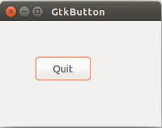
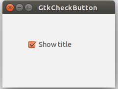
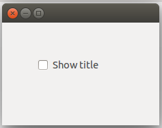
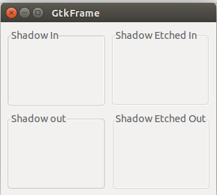
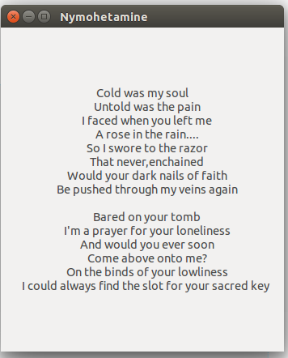

**（一）：写在前面**

<hr></hr>

在这篇文章中主要介绍了GTK+程序中的各种构件，这是讲解构件的第一个部分，另外一部分将在下一个小节中讲到。构件是建立一个GUI程序的基础。在GTK+的长期发展过程中，一些特定的构件逐渐成为了大多数编程工具集和几乎所有的操作系统的公用标准了。例如，按钮，选择框或者是一个滑动条。对于GTK+来说，内置了很多常用的专用构件，供我们使用。

**（二）：GtkButton**

<hr></hr>


GtkButton是一个简单易用的构件，通常被用于触发一个动作。

下面我们来看一下GtkButton的使用方法：

```
#include <gtk/gtk.h>

int main(int argc,char *argv[])
{
    GtkWidget *window;
    GtkWidget *fixed;
    GtkWidget *button;

    gtk_init(&argc,&argv);

    window = gtk_window_new(GTK_WINDOW_TOPLEVEL);
    gtk_window_set_title(GTK_WIDGET(window),"GtkButton");
    gtk_window_set_default_size(GTK_WINDOW(window),230,150);
    gtk_window_set_position(GTK_WINDOW(window),GTK_WIN_POS_CENTER);

    fixed = gtk_fixed_new();
    gtk_container_add(GTK_CONTAINER(window),fixed);

    button = gtk_button_new_with_label("Quit");

    gtk_fixed_put(GTK_FIXED(fixed),button,50,50);
    gtk_widget_set_size_request(button,80,35);

    g_signal_connect(G_OBJECT(button),"clicked",G_CALLBACK(gtk_main_quit),G_OBJECT(window));
    g_signal_connect_swapped(G_OBJECT(window),"destroy",G_CALLBACK(gtk_main_quit),NULL);

    gtk_widget_show_all(window);

    gtk_main();

    return 0;
}
```

在上面的例子中，就是展示一个按钮放置在一个fixed容器中，当我们按下按钮的时候，程序就会退出。

```
button = gtk_button_new_with_label("Quit");
```

这段代码就生成了一个带有标签的GtkButton构件。

同时结合我们上一小节学过的事件，为按钮添加相应的事件，就可以了：

```
g_signal_connect(G_OBJECT(button),"clicked",G_CALLBACK(gtk_main_quit),G_OBJECT(window));

```

我们来看一下运行效果：



**（三）：GtkCheckButton**

GtkCheckButton也是一个构件，他有两种状态，“开”和“关”，开表示一个可见的浮复选标记。

我们来看一下他的用法：

```
#include <gtk/gtk.h>

void toggle_title(GtkWidget *widget,gpointer window)
{
    if(gtk_toggle_button_get_active(GTK_TOGGLE_BUTTON(widget))){
        gtk_window_set_title(window,"GtkCheckButton");
    }else{
        gtk_window_set_title(window,"");
    }
}

int main(int argc,char *argv[])
{
    GtkWidget *window;
    GtkWidget *frame;
    GtkWidget *check;

    gtk_init(&argc,&argv);

    window = gtk_window_new(GTK_WINDOW_TOPLEVEL);
    gtk_window_set_position(GTK_WINDOW(window),GTK_WIN_POS_CENTER);
    gtk_window_set_default_size(GTK_WINDOW(window),230,150);
    gtk_window_set_title(GTK_WINDOW(window),"GtkCheckButton");

    frame = gtk_fixed_new();
    gtk_container_add(GTK_CONTAINER(window),frame);

    check = gtk_check_button_new_with_label("Show title");
    gtk_toggle_button_set_active(GTK_TOGGLE_BUTTON(check),TRUE);
    GTK_WIDGET_UNSET_FLAGS(check,GTK_CAN_FOCUS);

    gtk_fixed_put(GTK_FIXED(frame),check,50,50);

    g_signal_connect_swapped(G_OBJECT(window),"destroy",G_CALLBACK(gtk_main_quit),NULL);
    g_signal_connect(G_OBJECT(check),"clicked",G_CALLBACK(toggle_title),(gpointer)window);

    gtk_widget_show_all(window);

    gtk_main();
    return 0;
}


```

我们要展示的功能就是：标题栏的显示状态根据构件GtkCheckButton的状态变化而变化。

```
    check = gtk_check_button_new_with_label("Show title");
    gtk_toggle_button_set_active(GTK_TOGGLE_BUTTON(check),TRUE);
    
```

一个`GtkCheckButton`构件被生成了并且默认为已标记（即状态为打开）。

```
    GTK_WIDGET_UNSET_FLAGS(check,GTK_CAN_FOCUS);
```
这行代码是取消了对复选框的默认锁定，这样做到原因很简单，是因为我们可以任意设置复选框外面是否“罩”上一个“框”。

而最上面的监听函数就是实现功能的关键位置：这样，标题栏的显示状态根据构件GtkCheckButton的状态变化而变化。

我们来看一下运行效果：





**（四）：GtkFrame**

GTkFrame是一种装饰性的框架，还可以为他设置一个标签（可有可无）。

我们来看一看GtkFrame是如何使用的，以及其使用后的效果：

```
#include <gtk/gtk.h>

int main(int argc,char *argv[])
{
    GtkWidget *window;
    GtkWidget *table;


    GtkWidget *frame1;
    GtkWidget *frame2;
    GtkWidget *frame3;
    GtkWidget *frame4;

    gtk_init(&argc,&argv);

    window = gtk_window_new(GTK_WINDOW_TOPLEVEL);
    gtk_window_set_position(GTK_WINDOW(window),GTK_WIN_POS_CENTER);
    gtk_window_set_default_size(GTK_WINDOW(window),250,250);
    gtk_window_set_title(GTK_WINDOW(window),"GtkFrame");

    gtk_container_set_border_width(GTK_CONTAINER(window),10);

    table = gtk_table_new(2,2,TRUE);
    gtk_table_set_row_spacings(GTK_TABLE(table),10);
    gtk_table_set_col_spacings(GTK_TABLE(table),10);
    gtk_container_add(GTK_CONTAINER(window),table);

    frame1 = gtk_frame_new("Shadow In");
    gtk_frame_set_shadow_type(GTK_FRAME(frame1),GTK_SHADOW_IN);


    frame2 = gtk_frame_new("Shadow out");
    gtk_frame_set_shadow_type(GTK_FRAME(frame2),GTK_SHADOW_OUT);

    frame3 = gtk_frame_new("Shadow Etched In");
    gtk_frame_set_shadow_type(GTK_FRAME(frame3),GTK_SHADOW_ETCHED_IN);

    frame4 = gtk_frame_new("Shadow Etched Out");
    gtk_frame_set_shadow_type(GTK_FRAME(frame4),GTK_SHADOW_ETCHED_OUT);

    gtk_table_attach_defaults(GTK_TABLE(table),frame1,0,1,0,1);
    gtk_table_attach_defaults(GTK_TABLE(table),frame2,0,1,1,2);
    gtk_table_attach_defaults(GTK_TABLE(table),frame3,1,2,0,1);
    gtk_table_attach_defaults(GTK_TABLE(table),frame4,1,2,1,2);

    g_signal_connect_swapped(G_OBJECT(window),"destroy",G_CALLBACK(gtk_main_quit),G_OBJECT(window));

    gtk_widget_show_all(window);

    gtk_main();
    return 0;
}

```

这个实例我们展示了四种不同风格的frame框架。这些框架构件是利用表格所无法布局的。

```
 frame1 = gtk_frame_new("Shadow In");
 gtk_frame_set_shadow_type(GTK_FRAME(frame1),GTK_SHADOW_IN);

```

我们生成了一个`GtkFrame`构件，并且还为他设置了阴影种类。



**（五）：GtkLabel**

GtkLabel的功能很明显，是用来显示文字的，当然，他也会支持markup语法，我们在这里展示两个例子：

1：普通GtkLabel的使用

```
#include <gtk/gtk.h>

int main(int argc,char *argv[])
{
    GtkWidget *window;
    GtkWidget *label;

    gtk_init(&argc,&argv);

    window = gtk_window_new(GTK_WINDOW_TOPLEVEL);
    gtk_window_set_position(GTK_WINDOW(window),GTK_WIN_POS_CENTER);
    gtk_window_set_title(GTK_WINDOW(window),"Nymohetamine");
    gtk_window_set_default_size(GTK_WINDOW(window),350,400);

    label = gtk_label_new("Cold was my soul\n\
    Untold was the pain\n\
    I faced when you left me\n\
    A rose in the rain....\n\
    So I swore to the razor\n\
    That never,enchained\n\
    Would your dark nails of faith\n\
    Be pushed through my veins again\n\
    \n\
    Bared on your tomb\n\
    I'm a prayer for your loneliness\n\
    And would you ever soon\n\
    Come above onto me?\n\
    On the binds of your lowliness\n\
    I could always find the slot for your sacred key ");

    gtk_label_set_justify(GTK_LABEL(label),GTK_JUSTIFY_CENTER);

    gtk_container_add(GTK_CONTAINER(window),label);

    g_signal_connect_swapped(G_OBJECT(window),"destroy",G_CALLBACK(gtk_main_quit),NULL);

    gtk_widget_show_all(window);

    gtk_main();
    return 0;
}

```

在这里显示了一个歌词，居中显示，我们来看一下运行效果：



2：支持markup语法的label

下面我们来展示GtkLabel如何支持markup语法：

```
#include <gtk/gtk.h>

int main(int argc,char *argv[])
{
    GtkWidget *window;
    GtkWidget *label;

    gtk_init(&argc,&argv);

    window = gtk_window_new(GTK_WINDOW_TOPLEVEL);
    gtk_window_set_position(GTK_WINDOW(window),GTK_WIN_POS_CENTER);
    gtk_window_set_title(GTK_WINDOW(window),"markup label");

    char *str = "<b>ZetCode</b>,Knowledge only matters";

    label = gtk_label_new(NULL);
    gtk_label_set_markup(GTK_LABEL(label),str);

    gtk_label_set_justify(GTK_LABEL(label),GTK_JUSTIFY_CENTER);

    gtk_container_add(GTK_CONTAINER(window),label);

    gtk_widget_show(label);

    gtk_window_set_default_size(GTK_WINDOW(window),300,100);

    g_signal_connect(window,"destroy",G_CALLBACK(gtk_main_quit),NULL);

    gtk_widget_show(window);


    gtk_main();
    return 0;
}

```

下面就是支持markup语法效果的label：


**（六）：写在后面**

在这里，我们先介绍几种常用的GTK+中的构件，后面一节我们会接着介绍GTK+中还有哪些有用的构件。


