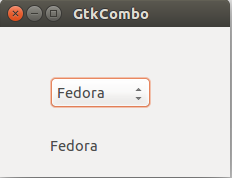
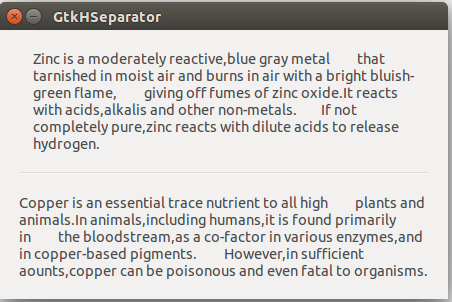
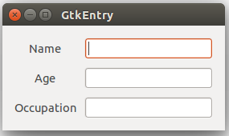
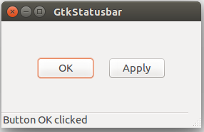
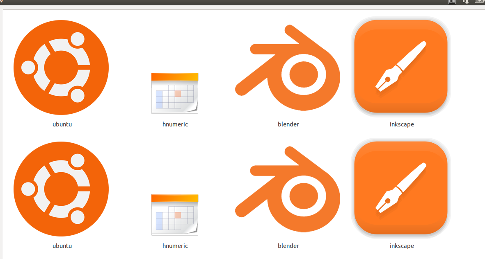

**（一）：写在前面**

在上面一个小节中，我们讲解了在GTK+2.0中的一些常用的构件，在这一小节中，我们将继续学习GTK+中常用的稍微复杂的构件，这里我们主要是学习`GtkComboBox`，`GtkEntry`，`GtkIconView`,`GtkImage`,`GtkSeparator`,`GtkStatusBar`。好了，现在我们开始我们的学习之旅。

**（二）：GtkComboBox**

GtkComboBox构件的作用是让程序使用者根据不同的需求从很多选项中进行选择。

下面我们来看一下如何使用GTkComboBox。

```
#include <gtk/gtk.h>

void combo_selected(GtkWidget *widget,gpointer window)
{
    gchar *text = gtk_combo_box_get_active_text(GTK_COMBO_BOX(widget));
    gtk_label_set_text(GTK_LABEL(window),text);
    g_free(text);
}

int main(int argc,char *argv[])
{
    GtkWidget *window;
    GtkWidget *fixed;
    GtkWidget *combo;
    GtkWidget *label;

    gtk_init(&argc,&argv);

    window = gtk_window_new(GTK_WINDOW_TOPLEVEL);
    gtk_window_set_title(GTK_WINDOW(window),"GtkCombo");
    gtk_window_set_position(GTK_WINDOW(window),GTK_WIN_POS_CENTER);
    gtk_window_set_default_size(GTK_WINDOW(window),230,150);

    fixed = gtk_fixed_new();

    combo = gtk_combo_box_new_text();
    gtk_combo_box_append_text(GTK_COMBO_BOX(combo),"Ubuntu");
    gtk_combo_box_append_text(GTK_COMBO_BOX(combo),"Mandriva");
    gtk_combo_box_append_text(GTK_COMBO_BOX(combo),"Fedora");
    gtk_combo_box_append_text(GTK_COMBO_BOX(combo),"Mint");
    gtk_combo_box_append_text(GTK_COMBO_BOX(combo),"Gentoo");
    gtk_combo_box_append_text(GTK_COMBO_BOX(combo),"Debian");

    gtk_fixed_put(GTK_FIXED(fixed),combo,50,50);
    gtk_container_add(GTK_CONTAINER(window),fixed);

    label = gtk_label_new("-");
    gtk_fixed_put(GTK_FIXED(fixed),label,50,110);

    g_signal_connect_swapped(G_OBJECT(window),"destroy",G_CALLBACK(gtk_main_quit),G_OBJECT(window));

    g_signal_connect(G_OBJECT(combo),"changed",G_CALLBACK(combo_selected),(gpointer)label);

    gtk_widget_show_all(window);

    gtk_main();

    return 0;
}

```

上面的例子主要是完成了一个下拉选择框和一个标签。在这里下拉选择框有六个选项。标签中的内容就是我们选择的那个选项的内容。

```
combo = gtk_combo_box_new_text();
gtk_combo_box_append_text(GTK_COMBO_BOX(combo),"Ubuntu");
gtk_combo_box_append_text(GTK_COMBO_BOX(combo),"Mandriva");
gtk_combo_box_append_text(GTK_COMBO_BOX(combo),"Fedora");
gtk_combo_box_append_text(GTK_COMBO_BOX(combo),"Mint");
gtk_combo_box_append_text(GTK_COMBO_BOX(combo),"Gentoo");
gtk_combo_box_append_text(GTK_COMBO_BOX(combo),"Debian");
    
```

在上面，我们生成了一个GtkComboBox构件，然后又把Linux发行版本的名字添加进去。

```
gchar *text = gtk_combo_box_get_active_text(GTK_COMBO_BOX(widget));
gtk_label_set_text(GTK_LABEL(window),text);
g_free(text);

```

上面的代码表明，我们从所选的选项中获得了文本内容，并且把此内容传递给了标签构件。在GTK+的API中，函数`gtk_combo_box_get_active_text()`的返回值是当前最新激活选项所对应的内容。同时，我们也有必要释放对应的内存空间。

我们来看一下运行效果：



**（三）：GtkHSeparator**

GtkHSeparator构件是一条水平分割线。这也属于一种布局构件。与之对应的竖直分割线构件为`GtkVSeparator`。

我们来看一下该构件的使用方法：

```
#include <gtk/gtk.h>

int main(int argc,char *argv[])
{
    GtkWidget *window;
    GtkWidget *label1;
    GtkWidget *label2;
    GtkWidget *hseparator;
    GtkWidget *vbox;

    gtk_init(&argc,&argv);

    window = gtk_window_new(GTK_WINDOW_TOPLEVEL);
    gtk_window_set_position(GTK_WINDOW(window),GTK_WIN_POS_CENTER);
    gtk_window_set_title(GTK_WINDOW(window),"GtkHSeparator");
    gtk_window_set_resizable(GTK_WINDOW(window),FALSE);

    gtk_container_set_border_width(GTK_CONTAINER(window),20);

    label1 = gtk_label_new("Zinc is a moderately reactive,blue gray metal \
        that tarnished in moist air and burns in air with a bright bluish-green flame, \
        giving off fumes of zinc oxide.It reacts with acids,alkalis and other non-metals.\
        If not completely pure,zinc reacts with dilute acids to release hydrogen.");

    gtk_label_set_line_wrap(GTK_LABEL(label1),TRUE);

    label2 = gtk_label_new("Copper is an essential trace nutrient to all high \
        plants and animals.In animals,including humans,it is found primarily in \
        the bloodstream,as a co-factor in various enzymes,and in copper-based pigments. \
        However,in sufficient aounts,copper can be poisonous and even fatal to organisms.");
    gtk_label_set_line_wrap(GTK_LABEL(label2),TRUE);

    vbox = gtk_vbox_new(FALSE,10);

    gtk_container_add(GTK_CONTAINER(window),vbox);

    hseparator = gtk_hseparator_new();

    gtk_box_pack_start(GTK_BOX(vbox),label1,FALSE,TRUE,0);
    gtk_box_pack_start(GTK_BOX(vbox),hseparator,FALSE,TRUE,10);
    gtk_box_pack_start(GTK_BOX(vbox),label2,FALSE,TRUE,0);

    g_signal_connect_swapped(G_OBJECT(window),"destroy",G_CALLBACK(gtk_main_quit),G_OBJECT(window));

    gtk_widget_show_all(window);

    gtk_main();

    return 0;
}

```

在上面的代码中，我们展示了两个label构件，同时这两个构件被分割线分隔。

```
gtk_label_set_line_wrap(GTK_LABEL(label2),TRUE);
```

我们使用上面的方法来使文本换行。

```
 hseparator = gtk_hseparator_new();
```

通过该方法来生成一个水平分割线，最后把分割器放置在两个标签中间。

我们来看一下程序的运行效果：



**（四）：GtkEntry**

GtkEntry构件就是一个只有单行文本输入框的构件。他主要用来进行单行文本的输入。

```
#include <gtk/gtk.h>

int main(int argc,char *argv[])
{
    GtkWidget *window;
    GtkWidget *table;
    GtkWidget *label1;
    GtkWidget *label2;
    GtkWidget *label3;

    GtkWidget *entry1;
    GtkWidget *entry2;
    GtkWidget *entry3;

    gtk_init(&argc,&argv);

    window = gtk_window_new(GTK_WINDOW_TOPLEVEL);
    gtk_window_set_position(GTK_WINDOW(window),GTK_WIN_POS_CENTER);
    gtk_window_set_title(GTK_WINDOW(window),"GtkEntry");
    gtk_container_set_border_width(GTK_CONTAINER(window),10);

    table = gtk_table_new(3,2,FALSE);
    gtk_container_add(GTK_CONTAINER(window),table);

    label1 = gtk_label_new("Name");
    label2 = gtk_label_new("Age");
    label3 = gtk_label_new("Occupation");

    gtk_table_attach(GTK_TABLE(table),label1,0,1,0,1,GTK_FILL | GTK_SHRINK,GTK_FILL | GTK_SHRINK,5,5);
    gtk_table_attach(GTK_TABLE(table),label2,0,1,1,2,GTK_FILL | GTK_SHRINK,GTK_FILL | GTK_SHRINK,5,5);
    gtk_table_attach(GTK_TABLE(table),label3,0,1,2,3,GTK_FILL | GTK_SHRINK,GTK_FILL | GTK_SHRINK,5,5);

    entry1 = gtk_entry_new();
    entry2 = gtk_entry_new();
    entry3 = gtk_entry_new();

    gtk_table_attach(GTK_TABLE(table),entry1,1,2,0,1,GTK_FILL | GTK_SHRINK,GTK_FILL | GTK_SHRINK,5,5);
    gtk_table_attach(GTK_TABLE(table),entry2,1,2,1,2,GTK_FILL | GTK_SHRINK,GTK_FILL | GTK_SHRINK,5,5);
    gtk_table_attach(GTK_TABLE(table),entry3,1,2,2,3,GTK_FILL | GTK_SHRINK,GTK_FILL | GTK_SHRINK,5,5);

    gtk_widget_show(table);

    gtk_widget_show(label1);
    gtk_widget_show(label2);
    gtk_widget_show(label3);

    gtk_widget_show(entry1);
    gtk_widget_show(entry2);
    gtk_widget_show(entry3);

    gtk_widget_show(window);

    g_signal_connect(window,"destroy",G_CALLBACK(gtk_main_quit),NULL);

    gtk_main();

    return 0;
}

```

我们先来看一下运行效果：



通过代码可以看出，GtkEntry的使用方式和常规构件的使用方式是一样的，使用起来比较简单，而且使用起来比较方便。

**（五）：GtkImage**

`GtkImage`构件功能就是用来显示图像的。

我们来展示一下：

```
#include <gtk/gtk.h>

int main(int argc,char *argv[])
{
    GtkWidget *window;
    GtkWidget *image;

    gtk_init(&argc,&argv);

    window = gtk_window_new(GTK_WINDOW_TOPLEVEL);
    gtk_window_set_position(GTK_WINDOW(window),GTK_WIN_POS_CENTER);
    gtk_window_set_default_size(GTK_WINDOW(window),230,150);
    gtk_window_set_title(GTK_WINDOW(window),"Red Rock");
    gtk_window_set_resizable(GTK_WINDOW(window),FALSE);

    gtk_container_set_border_width(GTK_CONTAINER(window),2);

    image = gtk_image_new_from_file("redrock.jpg");
    gtk_container_add(GTK_CONTAINER(window),image);

    g_signal_connect_swapped(G_OBJECT(window),"destroy",G_CALLBACK(gtk_main_quit),G_OBJECT(window));

    gtk_widget_show_all(window);

    gtk_main();

    return 0;
}

```

在这里我们通过`GtkImage`来显示一张图片。

```
gtk_container_set_border_width(GTK_CONTAINER(window),2);

```

我们给这个图片设置了2PX的边框大小。

```
image = gtk_image_new_from_file("redrock.jpg");

```

这样，我们通过该方法来从一个图像文件中加载了图像。


**（六）：GtkStatusbar**

`GtkStatusbar`的功能是用来显示状态信息用的。他通常被自动强制放置于应用程序窗口的底部。

```
#include <gtk/gtk.h>

void button_pressed(GtkWidget *widget,gpointer window)
{
    gchar *str;
    str = g_strdup_printf("Button %s clicked",gtk_button_get_label(GTK_BUTTON(widget)));

    gtk_statusbar_push(GTK_STATUSBAR(window),gtk_statusbar_get_context_id(GTK_STATUSBAR(window),str),str);

    g_free(str);
}

int main(int argc,char *argv[])
{
    GtkWidget *window;
    GtkWidget *fixed;
    GtkWidget *button1;
    GtkWidget *button2;
    GtkWidget *statusbar;
    GtkWidget *vbox;

    gtk_init(&argc,&argv);

    window = gtk_window_new(GTK_WINDOW_TOPLEVEL);
    gtk_window_set_position(GTK_WINDOW(window),GTK_WIN_POS_CENTER);
    gtk_window_set_default_size(GTK_WINDOW(window),280,150);
    gtk_window_set_title(GTK_WINDOW(window),"GtkStatusbar");

    vbox = gtk_vbox_new(FALSE,2);

    fixed = gtk_fixed_new();
    gtk_container_add(GTK_CONTAINER(window),vbox);

    gtk_box_pack_start(GTK_BOX(vbox),fixed,TRUE,TRUE,1);

    button1 = gtk_button_new_with_label("OK");
    gtk_widget_set_size_request(button1,80,30);

    button2 = gtk_button_new_with_label("Apply");
    gtk_widget_set_size_request(button2,80,30);

    gtk_fixed_put(GTK_FIXED(fixed),button1,50,50);
    gtk_fixed_put(GTK_FIXED(fixed),button2,150,50);

    statusbar = gtk_statusbar_new();
    gtk_box_pack_start(GTK_BOX(vbox),statusbar,FALSE,TRUE,1);

    g_signal_connect(G_OBJECT(button1),"clicked",G_CALLBACK(button_pressed),G_OBJECT(statusbar));
    g_signal_connect(G_OBJECT(button2),"clicked",G_CALLBACK(button_pressed),G_OBJECT(statusbar));

    g_signal_connect_swapped(G_OBJECT(window),"destroy",G_CALLBACK(gtk_main_quit),G_OBJECT(window));

    gtk_widget_show_all(window);

    gtk_main();

    return 0;
}

```

在上面的例子中，我们展示了两个按钮和一个状态栏。当我们单击按钮的时候，相关信息就在状态栏中显示出来。

```
str = g_strdup_printf("Button %s clicked",gtk_button_get_label(GTK_BUTTON(widget)));

```

这样我们就生成了一条消息。

```
gtk_statusbar_push(GTK_STATUSBAR(window),gtk_statusbar_get_context_id(GTK_STATUSBAR(window),str),str);

```

接着，通过这个方法将消息放置在状态栏中。



**（七）：GtkIconView**

`GtkIconView`的功能是用来在一个栅格中显示一系列的图标。

```
#include <gtk/gtk.h>
#include <assert.h>

enum{
    COL_DISPLAY_NAME,
    COL_PIXBUF,
    NUM_COLS
};

GtkTreeModel *init_model(void)
{
    GtkListStore *list_store;
    GdkPixbuf *p1,*p2,*p3,*p4;
    GtkTreeIter iter;
    GError *err = NULL;

    p1 = gdk_pixbuf_new_from_file("ubuntu.png",&err);
    p2 = gdk_pixbuf_new_from_file("gnumeric.png",&err);
    p3 = gdk_pixbuf_new_from_file("blender.png",&err);
    p4 = gdk_pixbuf_new_from_file("inkscape.png",&err);

    assert(err == NULL);

    list_store = gtk_list_store_new(NUM_COLS,G_TYPE_STRING,GDK_TYPE_PIXBUF);

    int i = 0;

    for(i = 0;i < 50;i++){
        gtk_list_store_append(list_store,&iter);
        gtk_list_store_set(list_store,&iter,COL_DISPLAY_NAME,"ubuntu",COL_PIXBUF,p1,-1);

        gtk_list_store_append(list_store,&iter);
        gtk_list_store_set(list_store,&iter,COL_DISPLAY_NAME,"hnumeric",COL_PIXBUF,p2,-1);

        gtk_list_store_append(list_store,&iter);
        gtk_list_store_set(list_store,&iter,COL_DISPLAY_NAME,"blender",COL_PIXBUF,p3,-1);

        gtk_list_store_append(list_store,&iter);
        gtk_list_store_set(list_store,&iter,COL_DISPLAY_NAME,"inkscape",COL_PIXBUF,p4,-1);
    }

    return GTK_TREE_MODEL(list_store);

}

int main(int argc,char *argv[])
{
    GtkWidget *window;
    GtkWidget *icon_view;
    GtkWidget *sw;

    gtk_init(&argc,&argv);

    window = gtk_window_new(GTK_WINDOW_TOPLEVEL);
    gtk_window_set_title(GTK_WINDOW(window),"Icon View");
    gtk_window_set_position(GTK_WINDOW(window),GTK_WIN_POS_CENTER);
    gtk_container_set_border_width(GTK_CONTAINER(window),10);
    gtk_widget_set_size_request(window,350,330);

    sw = gtk_scrolled_window_new(NULL,NULL);
    gtk_container_add(GTK_CONTAINER(window),sw);

    gtk_scrolled_window_set_policy(GTK_SCROLLED_WINDOW(sw),GTK_POLICY_AUTOMATIC,GTK_POLICY_AUTOMATIC);
    gtk_scrolled_window_set_shadow_type(GTK_SCROLLED_WINDOW(sw),GTK_SHADOW_IN);

    icon_view = gtk_icon_view_new_with_model(init_model());

    gtk_container_add(GTK_CONTAINER(sw),icon_view);

    gtk_icon_view_set_text_column(GTK_ICON_VIEW(icon_view),COL_DISPLAY_NAME);
    gtk_icon_view_set_pixbuf_column(GTK_ICON_VIEW(icon_view),COL_PIXBUF);

    gtk_icon_view_set_selection_mode(GTK_ICON_VIEW(icon_view),GTK_SELECTION_MULTIPLE);

    g_signal_connect(window,"destroy",G_CALLBACK(gtk_main_quit),NULL);

    gtk_widget_show_all(window);

    gtk_main();

    return 0;
}

````

在这里我们显示了200个图标。

````
p1 = gdk_pixbuf_new_from_file("ubuntu.png",&err);
p2 = gdk_pixbuf_new_from_file("gnumeric.png",&err);
p3 = gdk_pixbuf_new_from_file("blender.png",&err);
p4 = gdk_pixbuf_new_from_file("inkscape.png",&err);
    
````

这样，我们就从磁盘中载入了四个图标。

```
list_store = gtk_list_store_new(NUM_COLS,G_TYPE_STRING,GDK_TYPE_PIXBUF);

```

我们讲存储文本和像素缓冲区的数据。

```
gtk_list_store_append(list_store,&iter);
        gtk_list_store_set(list_store,&iter,COL_DISPLAY_NAME,"ubuntu",COL_PIXBUF,p1,-1);
```

在上面的代码中，正是把新图标添加到准备显示的缓冲区中。

```
icon_view = gtk_icon_view_new_with_model(init_model());
gtk_container_add(GTK_CONTAINER(sw),icon_view);
gtk_icon_view_set_text_column(GTK_ICON_VIEW(icon_view),COL_DISPLAY_NAME);
gtk_icon_view_set_pixbuf_column(GTK_ICON_VIEW(icon_view),COL_PIXBUF);

```

最后，我们生成一个GtkIconView构件，然后把图标和图标文本整合在一起。



**（八）：写在后面**

这里，我们就把很多常用的组件学习完成了，后面我们将要学习使用GTK+中的树状列表构件。其实到了这里，我们就应该能够使用GTK+来编写我们的图形程序了。


