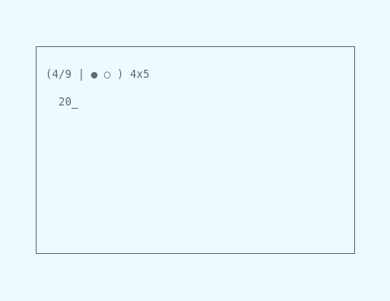

# Study

This is a project I wrote as a sophomore in highschool, mostly to help myself
learn French vocab. It's a more graphical version of an even clunkier,
command-line only flashcards program I wrote. This project was a lot of fun at
the time since it was so useful to me. I'm adding some screenshots, a sample
flashcard file, and this writeup in 2018.

It features several study modes that you can see above. The second screenshot is
the cryptically named "Study" mode, which requires you answer every problem
correctly twice in a row (similar to Quizlet or other services).

Some of the things this project taught me are

 * Writing some kind of UI
 * Writing a framework for the UI - `dialog.c` does all the drawing
 * A little I/O and deserialization of flashcards
 * Managing those data objects
 * Polishing something to a point where it's fairly usable, even if only by me
